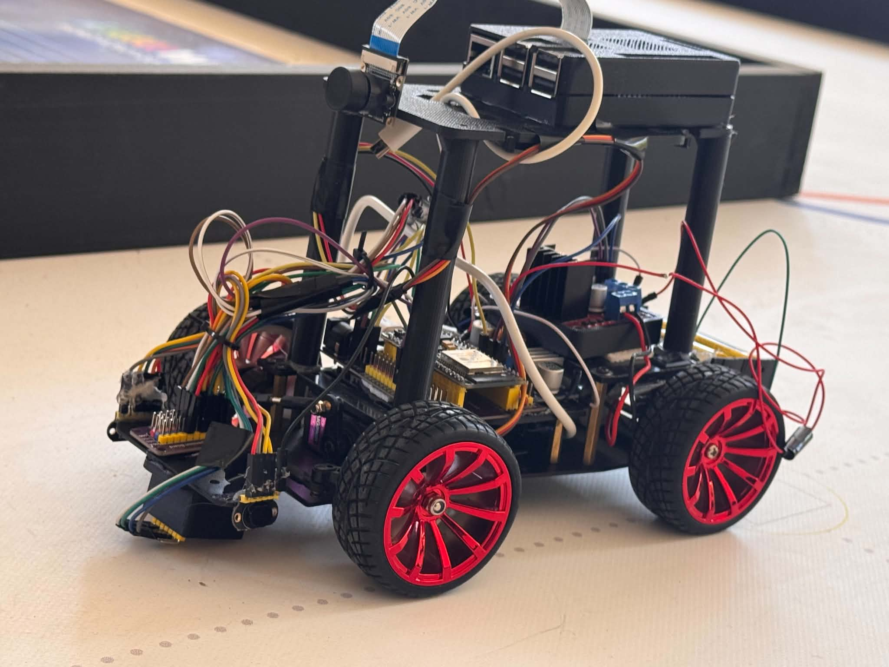
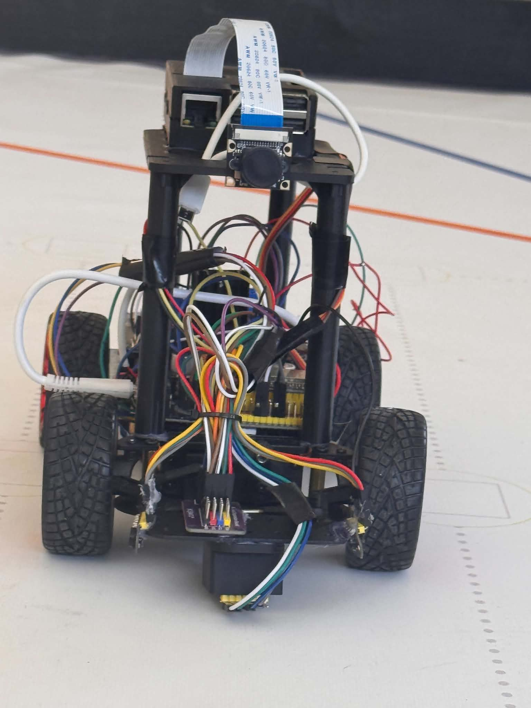
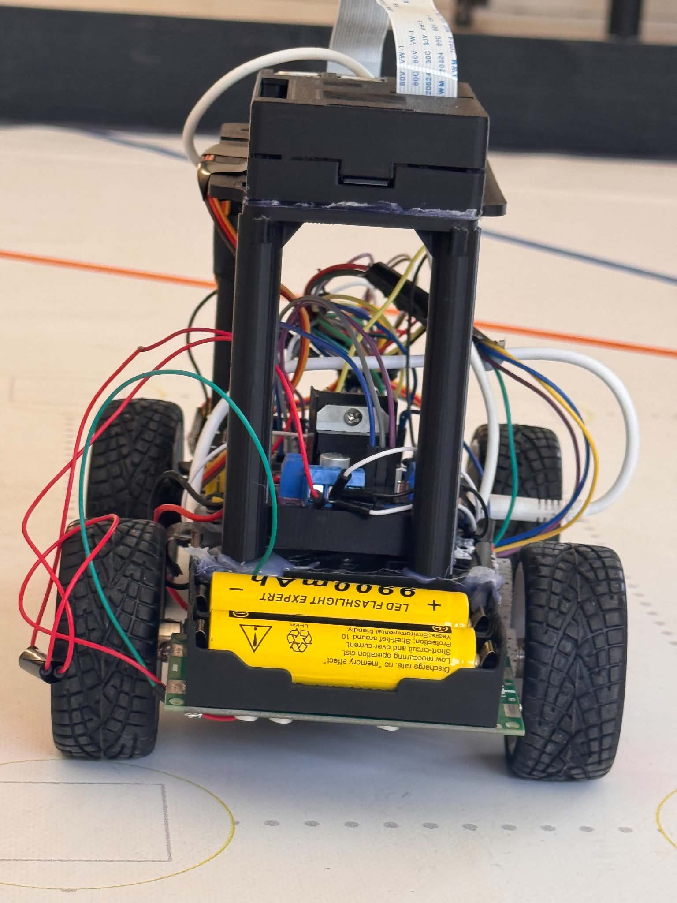
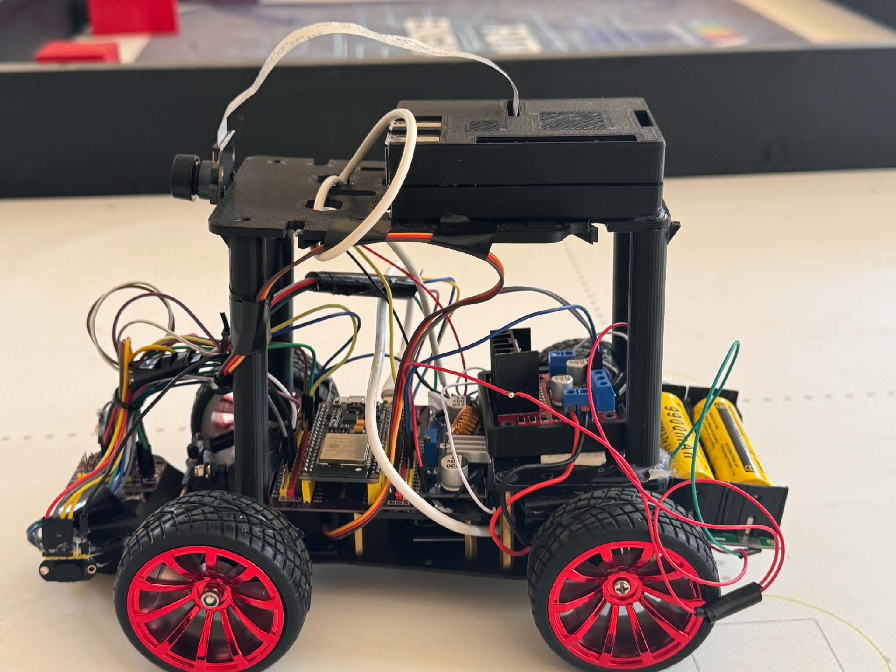
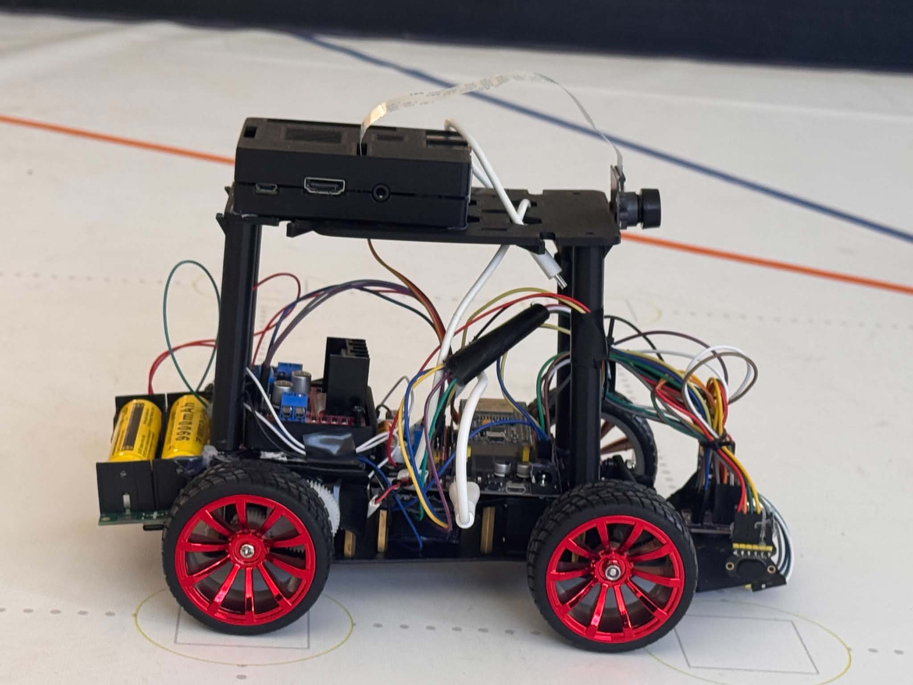
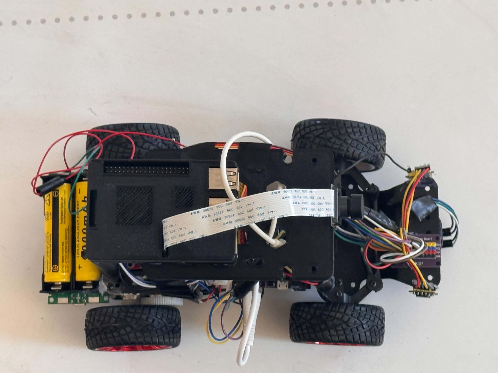
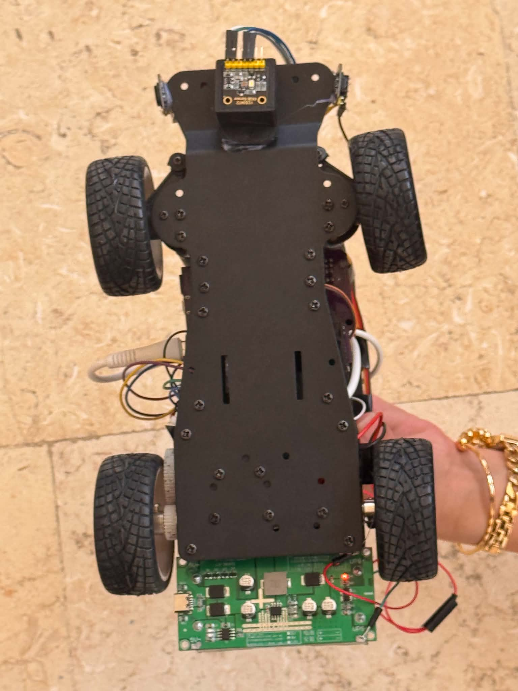

<div align="center">

# 🏎️ WRO Future Engineers 2026

## NextGen Minds 🇵🇸

### Birzeit University — Palestine

Autonomous Ackermann Steering Robot for the **World Robot Olympiad (WRO) Future Engineers 2026** competition.

<p>

</p>

---


</div>

---

# Overview

This repository documents the complete development of our autonomous vehicle for the **WRO Future Engineers 2026** competition.

Rather than presenting only the final robot, this repository documents the complete engineering journey—from the first design discussions and component selection to mechanical assembly, electronics integration, software development, testing, calibration, and continuous improvement.

The robot is built on an Ackermann steering chassis and combines real-time embedded control using an ESP32 with higher-level vision processing on a Raspberry Pi.

---

# Robot Highlights

- Ackermann steering vehicle
- Rear-wheel drive
- ESP32 real-time controller
- Raspberry Pi vision processor
- Dual VL53L1X Time-of-Flight sensors
- MPU6050 inertial measurement unit
- TCS34725 color sensor
- Raspberry Pi Camera
- Modular hardware architecture
- UART communication between controllers
- Fully documented engineering process

---

# Competition

**Competition:** World Robot Olympiad (WRO)

**Category:** Future Engineers

**Season:** 2026

The robot is designed to complete both official challenges:

- Open Challenge
- Obstacle Challenge

---

# Team

<p align="center">

</p>

We are **NextGen Minds**, a team of second-year Computer Engineering students from Birzeit University representing Palestine in the WRO Future Engineers 2026 competition.

For detailed information about our team members and responsibilities, see:

📄 **[TEAM.md](docs/TEAM.md)**


**Coach**

Osid Ali

**Institution**

Birzeit University

**Country**

Palestine 🇵🇸

---

# Robot Architecture

The robot follows a distributed architecture where each controller has a dedicated responsibility.

| Controller | Responsibilities |
|------------|------------------|
| Raspberry Pi 3 Model B | Computer vision, obstacle detection, navigation logic |
| ESP32 DevKit V1 | Motor control, steering, sensor acquisition, real-time control |

Communication between both controllers is performed using UART serial communication.

This architecture separates computationally intensive vision algorithms from deterministic real-time vehicle control, resulting in a more reliable and modular system.

---

# Robot Specifications

| Parameter | Value |
|-----------|------:|
| Steering | Ackermann |
| Drive | Rear-Wheel Drive |
| Main Controller | ESP32 DevKit V1 |
| Vision Processor | Raspberry Pi 3 Model B |
| Camera | Raspberry Pi Camera |
| Motor Driver | L298N |
| Steering Servo | MG996R |
| Distance Sensors | 2 × VL53L1X |
| IMU | MPU6050 |
| Color Sensor | TCS34725 |
| Power System | 2S Li-ion Battery + XL4015 Buck Converter |

---

# Repository Structure

```text
WRO-2026-FutureEngineers/

├── README.md

├── docs/
│   ├── HARDWARE.md
│   ├── SOFTWARE.md
│   ├── WIRING.md
│   ├── TESTING.md
│   ├── CALIBRATION.md
│   ├── CALCULATIONS.md
│   ├── DECISIONS.md
│   ├── JOURNAL.md
│   └── TEAM.md

├── src/
│   ├── esp32/
│   └── raspberry_pi/

├── images/

└── videos/
```
# Hardware

The robot combines commercially available components with custom mechanical mounts to create a reliable and modular autonomous platform.

Every hardware component was selected after evaluating multiple alternatives based on performance, reliability, compatibility, availability, and future scalability.

For detailed specifications and engineering justification, see:

📄 **[Hardware Documentation](docs/HARDWARE.md)**

📄 **[Engineering Decisions](docs/DECISIONS.md)**

---

## Main Components

| Component | Model |
|-----------|-------|
| Main Controller | ESP32 DevKit V1 |
| Vision Processor | Raspberry Pi 3 Model B |
| Camera | Raspberry Pi Camera Module |
| Motor Driver | L298N |
| Steering Servo | MG996R |
| Drive Motor | JGA25-370 DC Gear Motor |
| Distance Sensors | 2 × VL53L1X |
| IMU | MPU6050 |
| Color Sensor | TCS34725 |
| Power Supply | 2S Li-ion Battery |
| Voltage Regulator | XL4015 Buck Converter |

---

## Electronics

The electronics were designed around a distributed architecture.

The ESP32 performs all real-time tasks including:

- Steering control
- Motor control
- Sensor acquisition
- Safety functions

The Raspberry Pi performs computationally intensive tasks including:

- Camera processing
- Object detection
- Navigation logic
- Decision making

Both controllers communicate through a UART interface.

Complete wiring documentation is available in:

📄 **[WIRING.md](docs/WIRING.md)**

---

# Software

The software was developed as independent modules instead of a single monolithic program.

This modular design improves:

- Maintainability
- Debugging
- Reliability
- Future expansion

A clear separation exists between high-level vision processing and low-level embedded control.

For the complete software description, see:

📄 **[SOFTWARE.md](docs/SOFTWARE.md)**

---

## ESP32 Responsibilities

- Motor control
- Steering control
- Wall following
- Reading VL53L1X sensors
- Reading MPU6050
- Reading TCS34725
- Executing movement commands
- Communication with Raspberry Pi

---

## Raspberry Pi Responsibilities

- Image acquisition
- Computer vision
- Obstacle detection
- Navigation decisions
- UART communication

---

# Robot Capabilities

The robot is capable of:

- Autonomous driving
- Wall following
- Accurate 90° turns
- Obstacle detection
- Color marker recognition
- Heading correction using the IMU
- Real-time sensor fusion
- Modular software execution

---

# Engineering Documentation

This repository includes complete engineering documentation covering every stage of development.

| Document | Description |
|----------|-------------|
| HARDWARE.md | Hardware components and specifications |
| SOFTWARE.md | Software architecture |
| WIRING.md | Electrical wiring diagram |
| DECISIONS.md | Engineering decision process |
| CALCULATIONS.md | Engineering calculations |
| TESTING.md | Testing methodology |
| CALIBRATION.md | Calibration procedure |
| JOURNAL.md | Complete development history |
| TEAM.md | Team information |

---

# Development Process

The robot was developed through several engineering stages:

1. Research and planning
2. Component selection
3. Mechanical assembly
4. Electronics integration
5. Embedded software development
6. Computer vision development
7. Testing and debugging
8. Calibration
9. Performance optimization
10. Final validation

Each stage is documented in the Engineering Journal.

📄 **[JOURNAL.md](docs/JOURNAL.md)**

---

# Design Philosophy

Our goal was not simply to build a robot capable of completing the competition.

Instead, we focused on developing a modular engineering platform that could be continuously improved throughout the season.

Every major engineering decision—including hardware selection, software architecture, sensor placement, power distribution, and control strategy—was supported by research, testing, and repeated validation.

---

# Competition Challenges

## 🟢 Open Challenge

The Open Challenge focuses on autonomous navigation around the track for three complete laps without human intervention.

### Main Objectives

- Stable wall following
- Accurate 90° turns
- Reliable lap counting
- Consistent vehicle speed
- Heading correction using the IMU
- High repeatability

The robot combines dual VL53L1X distance sensors with IMU feedback to maintain a stable trajectory throughout the course.

---

## 🔴 Obstacle Challenge

The Obstacle Challenge extends the robot's capabilities by introducing dynamic navigation using computer vision.

### Planned Features

- Red pillar detection
- Green pillar detection
- Real-time obstacle avoidance
- Dynamic path planning
- Camera-based navigation
- Vision-assisted steering

These features are executed on the Raspberry Pi while the ESP32 continues handling all real-time vehicle control.

---

# Testing & Validation

Every subsystem was tested independently before full integration.

Testing included:

- Mechanical verification
- Steering calibration
- Motor testing
- Power stability
- Sensor validation
- UART communication
- Wall-following accuracy
- Corner detection
- Turn consistency
- Complete autonomous runs

For detailed testing procedures:

📄 **[TESTING.md](docs/TESTING.md)**

---

# Calibration

To ensure repeatable performance, each sensor was calibrated before testing.

Calibration includes:

- MPU6050 bias correction
- VL53L1X distance verification
- Color sensor threshold adjustment
- Steering center alignment
- Motor speed tuning

Complete calibration procedure:

📄 **[CALIBRATION.md](docs/CALIBRATION.md)**

---

# Engineering Calculations

The design was supported by engineering calculations throughout the project.

Topics include:

- Robot dimensions
- Weight analysis
- Turning geometry
- Power considerations
- Safety margins

See:

📄 **[CALCULATIONS.md](docs/CALCULATIONS.md)**

---

# Engineering Decisions

Throughout development, several alternative solutions were evaluated before selecting the final design.

Examples include:

- ESP32 vs Arduino
- Raspberry Pi integration
- Sensor selection
- Power architecture
- Chassis selection
- Communication protocol

The reasoning behind every major decision is documented in:

📄 **[DECISIONS.md](docs/DECISIONS.md)**

---

# Gallery

## Final Robot

<p align="center">

</p>

---

## Robot Views

| Front | Rear |
|------|------|
|  |  |

| Left | Right |
|------|------|
|  |  |

| Top | Bottom |
|------|------|
|  | |

---

## Team

<p align="center">

</p>

---

# Videos

The following demonstration videos are included with the project.

| Video | Description |
|--------|-------------|
| Open Challenge | Autonomous driving demonstration |
| Obstacle Challenge | Vision-based obstacle avoidance |
| Robot Overview | Complete hardware presentation |
| Software Demo | System architecture explanation |

Videos can be found inside the **videos/** directory.

---

# Engineering Journal

This repository documents the complete development history of the project.

The journal includes:

- Planning
- Research
- Hardware assembly
- Electronics
- Programming
- Testing
- Improvements
- Final validation

📄 **[JOURNAL.md](docs/JOURNAL.md)**

---

# Project Status

| Module | Status |
|---------|--------|
| Mechanical Design | ✅ Completed |
| Electronics | ✅ Completed |
| Embedded Software | ✅ Completed |
| Computer Vision | 🔄 In Progress |
| Testing | 🔄 Ongoing |
| Documentation | ✅ Completed |

---

# Repository Statistics

- Complete engineering documentation
- Modular software architecture
- Fully documented hardware
- Wiring diagrams
- Calibration procedures
- Testing methodology
- Engineering calculations
- Design decisions
- Development journal
  ---

# Future Improvements

Although the robot has reached a functional and competitive state, we believe engineering is a continuous process. Future improvements may include:

- Advanced sensor fusion algorithms
- PID auto-tuning
- Vision-based localization
- AI-assisted path planning
- Custom PCB design
- Lightweight 3D-printed mechanical components
- Improved power management
- Enhanced obstacle avoidance strategies

---

# Acknowledgments

We would like to express our sincere gratitude to everyone who supported this project.

Special thanks to:

- Our coach **Osid Ali** for his continuous guidance and valuable feedback.
- **Birzeit University** for providing an inspiring learning environment.
- The **World Robot Olympiad (WRO)** organization for encouraging innovation and engineering excellence.
- Our families and friends for their encouragement throughout the project.

---

# About This Repository

This repository is intended to document the complete engineering process behind our WRO Future Engineers robot.

It includes not only the final solution, but also the research, engineering decisions, testing procedures, calibration methods, calculations, and software architecture developed throughout the season.

Our goal is to maintain a clear, transparent, and professional engineering record of the project.

---

# Repository Documentation

The complete documentation can be found in the **docs/** directory.

| Document | Description |
|----------|-------------|
| 📄 HARDWARE.md | Hardware components and specifications |
| 📄 SOFTWARE.md | Software architecture |
| 📄 WIRING.md | Wiring and electronics |
| 📄 CALIBRATION.md | Calibration procedures |
| 📄 TESTING.md | Testing methodology |
| 📄 CALCULATIONS.md | Engineering calculations |
| 📄 DECISIONS.md | Design decisions |
| 📄 JOURNAL.md | Engineering journal |
| 📄 TEAM.md | Team information |

---

# Technologies Used

### Programming

- C++
- Python

### Embedded Systems

- ESP32 Arduino Framework
- UART Communication
- I²C Communication

### Computer Vision

- OpenCV
- Raspberry Pi Camera

### Sensors

- VL53L1X
- MPU6050
- TCS34725

### Mechanical

- Ackermann Steering
- RC Vehicle Platform

---

# License

This repository was created exclusively for the **World Robot Olympiad (WRO) Future Engineers 2026** competition.

All documentation, software, and mechanical designs were developed by **Team NextGen Minds** unless otherwise stated.

---

<div align="center">

## Thank You for Visiting Our Repository

We hope this repository clearly demonstrates our engineering process, technical decisions, and continuous development throughout the WRO Future Engineers 2026 season.

**Team NextGen Minds 🇵🇸**

**Birzeit University**

**World Robot Olympiad 2026**

⭐ If you found this project interesting, thank you for taking the time to explore our work.

</div>
