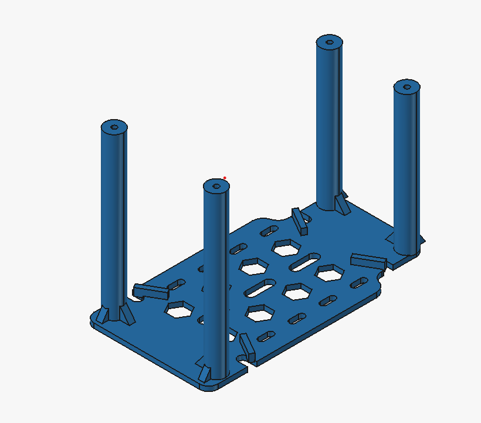

# Hardware Design

## Overview

The hardware platform of our WRO Future Engineers robot was designed to achieve reliable autonomous navigation while maintaining a compact, modular, and serviceable mechanical structure.

The robot combines embedded control, computer vision, distance sensing, inertial sensing, and color detection into a single integrated system. Instead of relying on a single controller for every task, the design separates low-level real-time control from computationally intensive image processing. This architecture allows each subsystem to perform its task efficiently without affecting the stability of the others.

The mechanical platform is based on a commercially available Ackermann steering RC chassis. A custom 3D-printed upper layer was added to provide sufficient mounting space for the Raspberry Pi, camera, and additional electronics while maintaining a clean internal layout.

Throughout the design process, every component was selected according to engineering criteria rather than convenience. The primary design objectives were:

- Reliable autonomous operation
- Accurate wall-distance measurement
- Stable steering performance
- Modular construction
- Easy maintenance
- Efficient power distribution
- Expandability for future improvements
- Mechanical robustness during repeated testing

The final robot integrates the following major subsystems:

- ESP32 real-time controller
- Raspberry Pi 3 Model B+
- Raspberry Pi Camera
- Two VL53L1X Time-of-Flight sensors
- MPU6050 Inertial Measurement Unit
- TCS34725 RGB Color Sensor
- MG996R steering servo
- Geared DC drive motor
- L298N motor driver
- XL4015 buck converter
- 2S Li-ion battery
- Ackermann steering chassis
- Custom and third-party 3D-printed mechanical parts

---

# Design Philosophy

Rather than designing every subsystem independently, the robot was developed as one integrated engineering system.

Every hardware decision considered its influence on:

- navigation accuracy,
- mechanical stability,
- electrical reliability,
- software implementation,
- future maintenance,
- and competition robustness.

For example, the camera position affects obstacle detection, but also influences weight distribution and cable routing. Likewise, the location of the distance sensors directly affects navigation accuracy, while also limiting the available space for other components.

This systems-engineering approach reduced unnecessary redesigns during development and simplified later software calibration.

---

# Hardware Architecture

The robot uses a distributed processing architecture consisting of two computing units.

The ESP32 performs all real-time operations including:

- sensor acquisition,
- steering control,
- motor control,
- navigation state management,
- and communication with the Raspberry Pi.

The Raspberry Pi is dedicated to computer vision. Separating image processing from the motion controller prevents camera-processing delays from affecting steering performance.

This architecture increases reliability because the control loop continues operating with deterministic timing regardless of camera processing load.

```
                        Raspberry Pi Camera
                                │
                                │
                       Raspberry Pi 3B+
                                │
                     High-level vision results
                                │
                                ▼
                           ESP32 DevKit
      ┌───────────────┬───────────────┬──────────────┐
      │               │               │              │
  VL53L1X         MPU6050         TCS34725       Motor Driver
      │               │               │              │
      └───────────────┴───────────────┴──────────────┘
                                │
                      Steering Servo + DC Motor
```

This separation also simplifies software development because the embedded firmware and computer-vision software can be developed and tested independently.

---

# Hardware Summary

| Category | Component | Model |
|----------|-----------|-------|
| Main Controller | ESP32 DevKit V1 | ESP32 |
| Vision Computer | Raspberry Pi | Raspberry Pi 3 Model B+ |
| Camera | Raspberry Pi Camera | CSI Camera |
| Distance Sensors | Time-of-Flight Sensors | 2 × VL53L1X |
| IMU | Gyroscope + Accelerometer | MPU6050 |
| Color Sensor | RGB Sensor | TCS34725 |
| Steering | Servo Motor | MG996R |
| Drive Motor | Geared DC Motor | Included with chassis |
| Motor Driver | Dual H-Bridge | L298N |
| Voltage Regulation | Buck Converter | XL4015 |
| Battery | Rechargeable Battery | 2S Li-ion |
| Chassis | Ackermann RC Chassis | Commercial Platform |

---

# Engineering Objectives

The hardware was designed to satisfy several engineering requirements simultaneously.

## Reliability

All critical electronic modules are securely mounted using dedicated holders or enclosures to reduce movement caused by vibration.

Electrical connections are mechanically supported to prevent accidental disconnection during repeated runs.

## Modularity

The robot can be disassembled without rebuilding the complete vehicle.

Most electronic modules can be removed individually for replacement, maintenance, or debugging.

## Weight Distribution

Heavy components such as the battery are positioned as low as practical to improve stability while cornering.

The additional upper layer was designed primarily for lightweight electronics to minimize the increase in the center of gravity.

## Cable Management

Power wiring and signal wiring are routed in an organized manner to reduce clutter and simplify maintenance.

Keeping cables organized also reduces the risk of obstructing the camera or distance sensors during operation.

## Expandability
The layered mechanical structure allows additional modules to be installed in future versions without redesigning the complete robot.
# Main Controller — ESP32 DevKit V1

The ESP32 DevKit V1 is the main real-time controller of the vehicle.

It is responsible for reading sensors, processing navigation data, controlling the steering servo, controlling the drive motor, and managing communication with the Raspberry Pi.

The ESP32 was selected because it provides a strong balance between processing performance, size, connectivity, and available input/output pins.

## Main Responsibilities

The ESP32 performs the following tasks:

- Reading both VL53L1X distance sensors
- Reading the MPU6050 inertial measurement unit
- Reading the TCS34725 color sensor
- Controlling the MG996R steering servo
- Controlling the L298N motor driver
- Executing wall-following behavior
- Detecting turns and track changes
- Managing the navigation state machine
- Filtering unstable sensor readings
- Receiving vision information from the Raspberry Pi

## Why the ESP32 Was Selected

Several controllers could have been used, but the ESP32 provided the best balance for this robot.

| Controller | Advantages | Limitations |
|---|---|---|
| Arduino Uno | Simple, low cost, and widely supported | Limited memory, lower processing speed, and fewer communication options |
| Arduino Mega | More input/output pins | Larger size and lower processing performance |
| Raspberry Pi only | High processing power | Less suitable for deterministic low-level motor control |
| ESP32 DevKit V1 | Fast processing, compact size, multiple communication interfaces, and good real-time performance | Requires careful 3.3 V logic handling and proper pin selection |

The ESP32 is more suitable for time-sensitive control than relying only on the Raspberry Pi.

## Engineering Considerations

The ESP32 operates using 3.3 V logic. Therefore, all connected signal lines must remain within safe voltage levels.

Careful pin selection is also required because some ESP32 pins have special boot or startup functions.

The ESP32 was mounted in a stable position and connected using short, organized signal wires to reduce the possibility of loose connections.

---

# Vision Computer — Raspberry Pi 3 Model B+

The Raspberry Pi 3 Model B+ is used as the high-level vision-processing computer.

Its main role is to process camera images and identify visual objects required for the Obstacle Challenge.

## Main Responsibilities

The Raspberry Pi is responsible for:

- Capturing camera frames
- Running Python-based vision software
- Processing images using OpenCV
- Detecting red and green traffic pillars
- Estimating the horizontal position of detected objects
- Supporting obstacle-avoidance decisions
- Sending higher-level information to the ESP32

## Why the Raspberry Pi Was Selected

Computer vision requires more memory and processing power than the ESP32 can efficiently provide.

The Raspberry Pi was selected because it:

- Supports Linux
- Supports Python
- Supports OpenCV
- Provides sufficient processing power for real-time camera analysis
- Can communicate with the ESP32
- Is compatible with common camera modules
- Allows rapid software testing and debugging

## Distributed Processing Advantage

The Raspberry Pi and ESP32 perform different tasks.

The Raspberry Pi handles high-level vision processing, while the ESP32 handles low-level control.

This reduces the chance that image-processing delays will interrupt steering or motor control.

## Trade-Offs

The Raspberry Pi increases:

- Power consumption
- Total vehicle weight
- Boot time
- Software complexity
- Cooling and mounting requirements

However, these disadvantages are acceptable because camera processing is essential for the Obstacle Challenge.

---

# Camera System

The camera is connected to the Raspberry Pi and provides the forward-facing visual input required for object detection.

The camera is positioned on the upper section of the robot to provide a clear view of the track and traffic pillars.

## Camera Functions

The camera system is used to:

- Detect red traffic pillars
- Detect green traffic pillars
- Estimate object position in the image
- Support left-right obstacle decisions
- Observe the track ahead of the vehicle

## Camera Mounting Requirements

The camera mount must provide:

- A stable angle
- A clear field of view
- Minimal vibration
- No obstruction from wires or electronic components
- Mechanical protection
- Easy access for adjustment

A small change in camera angle can affect the apparent position of objects in the image. Therefore, the mount must prevent unwanted movement during operation.

## Vision Reliability Considerations

Camera-based detection can be affected by:

- Lighting conditions
- Shadows
- Reflections
- Motion blur
- Camera vibration
- Changes in object distance
- Incorrect exposure
- Background colors

The vision software should therefore use calibrated color ranges and geometric filtering instead of relying on raw color values alone.

---

# Distance Sensing — Two VL53L1X Sensors

The robot uses two VL53L1X Time-of-Flight distance sensors.

These sensors measure distance using infrared light and are used to observe surrounding walls and track geometry.

## Main Uses

The VL53L1X sensors support:

- Wall-distance measurement
- Wall-following
- Detecting sudden distance changes
- Detecting openings
- Supporting corner detection
- Comparing the vehicle position with nearby walls
- Improving navigation stability

## Why Two Sensors Are Used

A single sensor provides only one distance measurement.

Using two sensors gives the robot more information about the surrounding geometry and helps reduce dependence on one reading.

The two readings can be used to:

- Compare wall-distance changes
- Detect whether the robot is moving toward or away from a wall
- Identify the beginning or end of a wall
- Support more stable turning decisions
- Reject clearly invalid readings

## Why VL53L1X Was Selected

Ultrasonic sensors were considered, but Time-of-Flight sensing was more suitable for the compact vehicle.

| Feature | Ultrasonic Sensor | VL53L1X |
|---|---|---|
| Measurement method | Reflected sound | Reflected infrared light |
| Beam width | Relatively wide | More focused |
| Size | Usually larger | Compact |
| Interface | Trigger and echo | I²C |
| Suitability for compact robot | Moderate | High |
| Final use | Not used | Selected |

## Sensor Limitations

VL53L1X readings may be affected by:

- Dark surfaces
- Highly reflective surfaces
- Incorrect sensor angle
- Excessive distance
- Very short distance
- Vibration
- Partial obstruction
- Seeing a different wall during a turn

The software should not react to every individual reading.

Instead, it should validate, filter, and compare measurements over time.

## Mounting Considerations

The sensor mounts must:

- Keep the sensors rigid
- Maintain the selected angle
- Prevent chassis parts from entering the field of view
- Avoid interference from wires
- Allow repeated measurements from the same reference position

The final sensor position should be documented with photographs and direction arrows.

---

# Inertial Measurement Unit — MPU6050

The MPU6050 is a six-axis inertial measurement unit containing:

- A three-axis gyroscope
- A three-axis accelerometer

The gyroscope provides rotational-rate information, while the accelerometer measures linear acceleration and gravity direction.

## Main Uses

The MPU6050 is used to:

- Detect angular movement
- Support turn detection
- Estimate heading change
- Improve turn repeatability
- Confirm that the vehicle is rotating
- Support future sensor-fusion improvements

## Why the MPU6050 Was Selected

The MPU6050 is:

- Compact
- Widely available
- Easy to connect using I²C
- Suitable for measuring rotational motion
- Supported by many software libraries

## Sensor Drift

Gyroscopes do not produce perfectly zero output when stationary.

This small bias accumulates over time and causes drift if angular velocity is integrated continuously.

For this reason:

- The sensor is calibrated before motion begins
- Initial bias is measured while the robot is stationary
- The IMU is not used as the only navigation reference
- Distance and color sensors are used as complementary information

## Mounting Position

The MPU6050 should be mounted:

- Firmly
- Parallel to the vehicle frame
- Away from loose mechanical parts
- Near the central area of the robot when possible
- In a position that does not flex or vibrate independently

---

# Floor Color Sensor — TCS34725

The TCS34725 is an RGB color sensor used to detect colored floor markings.

It measures:

- Red intensity
- Green intensity
- Blue intensity
- Clear-light intensity

## Main Uses

The sensor is used to:

- Detect orange floor markings
- Detect blue floor markings
- Determine the driving direction
- Trigger navigation-state changes
- Support lap or corner logic

## Why a Dedicated Color Sensor Was Used

Using the camera alone to detect floor markings would require the floor area to remain visible and would increase processing complexity.

A downward-facing color sensor provides a direct and fast measurement close to the track surface.

## Mounting Requirements

The sensor must be mounted:

- Facing downward
- At a consistent height
- Protected from direct ambient light
- Clear of the chassis
- Close enough to the surface for strong readings
- High enough to avoid contact with the track

The 3D-printed cover reduces external-light interference and helps keep the sensor position stable.

## Calibration Requirements

Raw color values depend on:

- Lighting
- Sensor height
- Surface texture
- Shadows
- Sensor gain
- Integration time

The software should therefore use calibrated ratios or thresholds instead of assuming one universal raw value.

---

# Steering Servo — MG996R

The MG996R servo controls the Ackermann steering linkage.

It receives a PWM command from the ESP32 and moves the front wheels to the required steering angle.

## Why the MG996R Was Selected

The steering mechanism requires enough torque to overcome:

- Tire friction
- Mechanical resistance
- Vehicle weight
- Steering-linkage friction
- Dynamic forces during movement

A small micro servo may be lighter, but it may not provide sufficient torque for reliable steering.

| Servo Type | Advantage | Limitation |
|---|---|---|
| Micro servo | Low weight and low current | Lower torque |
| MG996R | Higher torque and metal gears | Higher current and larger size |

The MG996R was selected because steering reliability was more important than minimizing servo weight.

## Servo Calibration

The steering system requires both mechanical and software calibration.

The recommended process is:

1. Command the servo to its center position.
2. Align the front wheels mechanically.
3. Install the servo horn.
4. Adjust the steering linkage.
5. Determine the true center command.
6. Determine safe left and right limits.
7. Prevent the servo from forcing the linkage beyond its mechanical range.

The software should define:

- Steering center
- Maximum safe left angle
- Maximum safe right angle
- Normal correction range
- Turn steering angle

## Power Considerations

The MG996R can draw a high current, especially during rapid movement or mechanical load.

It must not be powered directly from an ESP32 signal pin.

It requires a suitable external power supply with a common ground shared with the ESP32.

---

# Drive Motor

The robot uses a geared DC motor included with the commercial chassis.

The gearbox reduces motor speed and increases wheel torque.

This is suitable for an autonomous robot because controlled motion and sufficient torque are more important than maximum free-running speed.

## Drive Requirements

The drive system must provide:

- Forward movement
- Adjustable speed
- Smooth acceleration
- Reliable torque while steering
- Repeatable behavior
- Reverse operation when required for testing or recovery

The drive motor is controlled through the L298N motor driver.

---

# L298N Motor Driver

The L298N is a dual H-bridge motor-driver module.

It allows the ESP32 to control the motor direction and speed without supplying motor current directly.

## Main Functions

The L298N provides:

- Forward motor control
- Reverse motor control
- PWM speed control
- Electrical separation between logic signals and motor current

## Why the L298N Was Used

The L298N was selected because it is:

- Widely available
- Easy to test
- Simple to connect
- Suitable for the installed motor during development

## Limitations

The L298N uses an older bipolar-transistor design.

Its main disadvantages are:

- Significant voltage drop
- Lower efficiency than modern MOSFET drivers
- Heat generation
- Larger physical size

These limitations should be considered when calibrating motor speed.

The effective voltage reaching the motor may be lower than the battery voltage.

## Mechanical Installation

The motor driver is installed in a dedicated 3D-printed holder to:

- Prevent movement
- Reduce connector stress
- Protect wiring
- Improve cable organization
- Simplify removal and replacement
# Power System

The robot is powered by a rechargeable 2S lithium-ion battery.

A 2S battery contains two lithium-ion cells connected in series. This provides a nominal voltage of approximately 7.4 V, while the actual voltage changes according to the battery state of charge.

The power system was designed to supply both high-current loads and sensitive electronic modules without relying on one unstable power path.

The main electrical loads are:

- Geared DC drive motor
- MG996R steering servo
- ESP32 controller
- Raspberry Pi 3 Model B+
- Camera
- VL53L1X sensors
- MPU6050
- TCS34725
- L298N motor driver
- Additional indicators and communication modules

---

## Power Distribution Architecture

The battery output is divided into two main paths:

1. A motor-power path for the L298N and drive motor
2. A regulated electronics path through the XL4015 buck converter

```text
                         2S Li-ion Battery
                                 │
                           Main Power Switch
                                 │
                 ┌───────────────┴───────────────┐
                 │                               │
                 ▼                               ▼
              L298N                          XL4015
                 │                               │
                 ▼                               ▼
          Geared DC Motor                Regulated Output
                                                 │
                       ┌─────────────────────────┼─────────────────────────┐
                       │                         │                         │
                     ESP32                  Steering Servo          Other Electronics
```

The exact final wiring and voltage connections are documented separately in [`WIRING.md`](WIRING.md).

## Why the Power Paths Are Separated

The DC motor and steering servo can draw rapidly changing current.

These current changes may cause:

- Voltage drops
- Electrical noise
- ESP32 resets
- Raspberry Pi instability
- Incorrect sensor readings
- Communication errors

Using a dedicated regulated supply for the sensitive electronics helps reduce the effect of motor-load variations.

All modules still require a common electrical ground so that control signals share the same voltage reference.

## Common Ground

The grounds of the following modules are connected together:

- Battery
- ESP32
- Raspberry Pi communication interface
- L298N
- XL4015
- Steering servo
- Sensors

Without a common ground, PWM signals, motor-control signals, and communication signals may not be interpreted correctly.

---

# XL4015 Buck Converter

The XL4015 is an adjustable DC step-down converter.

It reduces the battery voltage to a stable output voltage suitable for the electronic modules.

## Why Voltage Regulation Is Required

The battery voltage is not constant.

A fully charged 2S lithium-ion battery has a higher voltage than its nominal value, and the voltage gradually decreases during operation.

Sensitive components should not depend directly on this changing voltage.

The buck converter provides a more stable supply and helps protect the control electronics from excessive voltage.

## Reasons for Selecting the XL4015

The XL4015 was selected because it provides:

- Adjustable output voltage
- Suitable current capability
- Good availability
- Simple physical integration
- A more efficient solution than linear regulation
- Sufficient capacity for the intended electronic load when correctly cooled and adjusted

## Converter Adjustment Procedure

Before connecting sensitive electronics, the converter is adjusted using the following process:

1. Disconnect the ESP32, Raspberry Pi, servo, and sensors.
2. Connect the battery to the XL4015 input.
3. Connect a multimeter to the converter output.
4. Turn the adjustment potentiometer gradually.
5. Measure the output voltage continuously.
6. Stop when the required voltage is reached.
7. Verify the output again before connecting the electronics.
8. Test the voltage under load.
9. Confirm that the converter does not overheat during extended operation.

This procedure reduces the risk of damaging the control electronics.

## Mechanical Enclosure

The XL4015 is installed inside a two-part 3D-printed enclosure.

The enclosure consists of:

```text
XL4015_Box_P1.3MF
XL4015_Box_P2_v2.3MF
```

The enclosure provides:

- Mechanical support
- Protection from accidental contact
- Improved cable organization
- Reduced risk of short circuits
- Easier removal and replacement

Ventilation openings should remain unobstructed because the converter may produce heat under load.

---

# Battery

The vehicle uses a rechargeable 2S lithium-ion battery.

## Battery Selection Criteria

The battery was selected according to:

- Required operating voltage
- Current capability
- Physical dimensions
- Weight
- Availability
- Rechargeability
- Compatibility with the drive system

## Battery Placement

The battery is one of the heaviest components in the vehicle.

It is therefore mounted as low as practical to reduce the height of the center of gravity.

Its location should also provide:

- Secure retention
- Easy access for charging and replacement
- Short power wiring
- Protection from moving parts
- Separation from sharp edges
- Minimal effect on steering motion

The battery must not be allowed to slide during acceleration or turning because movement changes the vehicle's weight distribution and may damage the wiring.

## Lithium-Ion Safety

The following precautions are required:

- Use a charger designed for the battery configuration.
- Do not short-circuit the battery terminals.
- Do not use a swollen, damaged, or overheated battery.
- Protect the wires from mechanical damage.
- Do not leave the battery connected when the robot is stored.
- Confirm correct polarity before connection.
- Secure the battery during every run.
- Monitor battery temperature during testing.
- Avoid excessive discharge.

---

# Main Power Switch

A main power switch is installed to allow the complete vehicle to be powered on and off quickly.

The switch provides:

- A clear startup procedure
- Fast emergency power isolation
- Reduced need to disconnect the battery repeatedly
- Safer maintenance
- Easier competition preparation

The switch must be easy to reach without entering the path of moving wheels or steering parts.

---

# Commercial Ackermann Chassis

The vehicle is built on a commercially available RC chassis with front-wheel Ackermann steering.

The chassis includes the main mechanical systems required for vehicle movement:

- Main frame
- Front steering linkage
- Front and rear wheels
- Axles
- Geared drive motor
- Drivetrain
- Servo mounting area
- Structural mounting points

## Why a Commercial Chassis Was Selected

Building a complete chassis from the beginning would require significant time for:

- Steering-geometry design
- Wheel alignment
- Axle design
- Bearing selection
- Gearbox design
- Motor mounting
- Structural testing
- Manufacturing and repeated mechanical adjustment

Using a commercial platform allowed the team to begin sensor integration and autonomous-navigation development earlier.

## Engineering Trade-Off

The commercial chassis provides a reliable mechanical starting point, but it also introduces limitations.

These include:

- Fixed wheelbase
- Fixed track width
- Limited component space
- Existing mounting-hole positions
- Additional weight
- Geometry that was not designed specifically for the competition electronics

These constraints were handled using custom mechanical layers and 3D-printed holders.

---

# Ackermann Steering Geometry

Ackermann steering allows the front wheels to rotate at different angles while cornering.

During a turn, the inner wheel follows a smaller-radius path than the outer wheel. Therefore, the inner wheel should turn more sharply.

This steering geometry reduces tire scrubbing and improves the natural turning behavior of the vehicle.

The commercial chassis already includes the required mechanical linkage, so the project focused on:

- Servo centering
- Steering-limit calibration
- Linkage alignment
- Mechanical play reduction
- Selecting safe software commands
- Testing the actual turning radius

The theoretical wheel angle is not assumed to be identical to the servo command. Mechanical linkage geometry, servo horn position, tire friction, and chassis load all affect the real steering response.

For this reason, the final steering values are obtained through physical calibration.

---

# Competition Size Compliance

The WRO Future Engineers vehicle must remain within the maximum permitted dimensions.

The current international Future Engineers category lists a maximum vehicle size of:

| Dimension | Maximum |
|---|---:|
| Length | 300 mm |
| Width | 200 mm |
| Height | 300 mm |

The complete vehicle must satisfy these limits, including:

- Wheels
- Camera
- Sensor mounts
- Wires
- Screw heads
- 3D-printed holders
- Upper layers
- Any permanently installed part

The official WRO website also notes that national organizers may apply local adaptations. Therefore, the final robot must be checked against the rules supplied by the local national organizer before competition. :contentReference[oaicite:0]{index=0}

## Recommended Engineering Margin

The robot should not be designed exactly at the legal maximum.

A practical target is:

| Dimension | Legal Maximum | Recommended Design Target |
|---|---:|---:|
| Length | 300 mm | Approximately 295 mm or less |
| Width | 200 mm | Approximately 195 mm or less |
| Height | 300 mm | Approximately 295 mm or less |

This margin helps account for:

- Measurement tolerance
- Small printed-part deviations
- Protruding wires
- Screw heads
- Camera mounts
- Assembly differences
- Different measuring tools

The final vehicle should be measured in its complete competition configuration.

---

# Layered Mechanical Structure

The robot uses a multi-layer mechanical arrangement to provide sufficient space for the electronics.

This arrangement separates the drivetrain, control electronics, and vision system while preserving access for maintenance.

## Base Mechanical Layer

The lowest level contains the primary mechanical components:

- Chassis frame
- Drive motor
- Gearbox
- Axles
- Wheels
- Steering linkage
- Steering servo
- Battery where mechanically suitable

Heavy components are kept low whenever possible.

## Electronics Layer

The middle level contains modules that require organized and relatively short electrical connections.

Typical components include:

- ESP32
- L298N
- XL4015
- Power-distribution connections
- Sensor connectors
- Communication wiring

This level allows access for debugging without removing the complete upper vision assembly.

## Custom Third Layer

A custom third layer was added because the original chassis did not provide sufficient mounting area for the Raspberry Pi, camera system, and additional electronics.

The third layer was developed through the following process:

1. The available chassis dimensions were measured.
2. The mounting locations and dimensions of the electronic components were measured.
3. Required clearances were identified.
4. Component placement was planned.
5. The necessary dimensions and layout were defined by the team.
6. Zoo was used to generate the digital CAD model from these requirements.
7. The model was exported for manufacturing.
8. The printed part was installed and physically tested.
9. Component fit and cable access were evaluated.

The design requirements therefore originated from the team, while Zoo assisted in generating the CAD geometry.

## Purpose of the Third Layer

The custom layer provides:

- Additional mounting area
- Improved organization
- A stable Raspberry Pi location
- Camera mounting support
- Better cable routing
- Separation between mechanical and vision components
- Easier maintenance
- Future expansion space

## Design Constraints

The upper layer had to satisfy several requirements:

- Remain inside the competition size limits
- Avoid interference with steering
- Avoid wheel contact
- Provide access to connectors
- Maintain camera visibility
- Remain sufficiently rigid
- Minimize unnecessary weight
- Allow air circulation around electronic modules
- Provide mounting-hole compatibility
- Avoid creating sharp edges near wires

---


# Weight Distribution

Weight distribution affects steering response, traction, and cornering stability.

The design follows these principles:

- Heavy components are placed as low as practical.
- The battery is mechanically secured.
- Left-right weight imbalance is minimized.
- Upper-layer mass is kept as low as practical.
- Components are prevented from moving during operation.
- Sensor visibility is not sacrificed only to improve balance.
- Steering components are not overloaded by unnecessary front weight.

## Center of Gravity

Adding a third layer raises some components above the original chassis.

This can increase the height of the center of gravity and cause greater body movement during turns.

To reduce this effect:

- The upper layer is used mainly for lightweight electronics.
- The battery and heavier power components remain lower where possible.
- Unnecessary printed material is avoided.
- Components are mounted close to the center rather than far outside the chassis.

## Front-Rear Balance

Excessive weight over the front axle can increase steering load and servo current.

Excessive rear weight can reduce front-wheel grip and steering effectiveness.

The component layout therefore aims to maintain enough front-wheel load for steering without overloading the servo.

---

# Mechanical Rigidity

Mechanical movement can directly reduce sensing accuracy.

For example:

- A moving camera changes object position in the image.
- A rotating ToF mount changes the measured wall distance.
- A flexible color-sensor holder changes the sensor-to-floor distance.
- A loose IMU mount introduces vibration and incorrect angular measurements.

For this reason, sensor mounts are treated as functional engineering components rather than decorative parts.

Each mount should be checked for:

- Cracks
- Loose screws
- Flexibility
- Rotation
- Wire tension
- Chassis contact
- Vibration during movement

---

# Cable Management

Cable organization improves both reliability and maintainability.

The wiring is routed to:

- Avoid the wheels
- Avoid the steering linkage
- Prevent obstruction of sensors
- Reduce strain on connectors
- Keep power and signal paths organized
- Allow individual modules to be removed
- Reduce accidental disconnection

## High-Current and Signal Wiring

Motor and servo wires carry higher and rapidly changing currents.

Sensor and communication wires carry low-level signals.

Where practical, high-current wiring is kept separated from sensitive signal wiring to reduce electrical interference.

Long loose wire loops are avoided because they may:

- Enter the wheel path
- Pull on connectors
- Block the camera
- Vibrate in front of sensors
- Make fault diagnosis difficult

## Service Loops

Cables should not be stretched tightly.

A small controlled service loop allows a module to be disconnected or moved without placing force on the connector.

However, excess wire should remain secured.

---

# Thermal Considerations

Several modules may generate heat during operation, especially:

- Raspberry Pi
- L298N motor driver
- XL4015 converter
- MG996R servo under heavy load

The mechanical design should not completely enclose heat-generating components without ventilation.

During testing, the team should check:

- L298N temperature
- XL4015 temperature
- Servo temperature
- Raspberry Pi temperature
- Connector temperature
- Battery temperature

Unexpected heat may indicate:

- Excessive current
- Mechanical binding
- Incorrect voltage
- Poor converter adjustment
- Motor overload
- Loose or high-resistance connections

---

# Maintainability

The robot was designed so that common maintenance tasks do not require rebuilding the complete vehicle.

The modular structure allows:

- Removal of the Raspberry Pi case
- Access to the ESP32
- Replacement of a sensor
- Adjustment of the buck converter
- Removal of the motor driver
- Inspection of wiring
- Camera-angle adjustment
- Battery replacement

Each module should be identifiable by its location and cable path.

Clear file names, wiring documentation, and labeled photographs further reduce repair time during competition preparation.

---

# Mechanical Pre-Run Inspection

Before every test or official run, the following mechanical checks should be performed:

- Confirm that the vehicle remains within the allowed dimensions.
- Check that all wheels rotate freely.
- Check that the steering linkage moves without binding.
- Confirm that the servo horn is secure.
- Check wheel alignment.
- Check that the battery is fixed in position.
- Confirm that the Raspberry Pi case is secure.
- Check that the camera angle has not changed.
- Confirm that both ToF sensors are rigid.
- Check that the color sensor remains at the calibrated height.
- Inspect printed parts for cracks.
- Confirm that no cable touches a wheel.
- Confirm that no cable blocks a sensor.
- Check that screws have not loosened.
- Verify that the upper layer does not flex excessively.

Any change in mechanical configuration should be followed by recalibration because sensor position and weight distribution affect navigation behavior.
# 3D-Printed Parts

The robot uses a combination of:

1. Team-defined custom mechanical parts
2. Third-party downloadable models
3. Protective covers and electronic-module holders

The origin of each part is documented to clearly distinguish the team's engineering work from externally sourced designs.

This distinction is important because the team did not claim authorship of models downloaded from the internet.

---

# Custom Mechanical Parts

## Custom Third-Layer Assembly

The third-layer assembly was created specifically for this robot.

The design process began with physical measurements performed by the team.

The team measured:

- Chassis dimensions
- Available mounting area
- Hole locations
- Electronic-module dimensions
- Required cable clearances
- Wheel and steering clearances
- Maximum permitted robot dimensions
- Required access to connectors and switches

After defining these requirements, Zoo was used to generate the CAD geometry.

Therefore:

- The engineering requirements were defined by the team.
- The physical dimensions were measured by the team.
- The component arrangement was planned by the team.
- Zoo assisted with creating the digital CAD model.
- The resulting model was printed and physically tested by the team.

# Custom CAD Files

The custom third-layer CAD model is provided below together with the original manufacturing files used for 3D printing.

<p align="center">
  
</p>

<p align="center">
  <em>Figure 1. Isometric view of the custom-designed third layer.</em>
</p>

## CAD Files

- [main.step](../cad/custom/main.step)


## STEP File

The STEP file preserves the editable three-dimensional geometry of the custom part. It allows future modifications, dimensional inspection, compatibility with CAD software, and manufacturing preparation.

## 3MF Files

The 3MF files are the printable versions of the custom part used during manufacturing. Depending on the slicing software, they may preserve model geometry, units, print orientation, object arrangement, and other print-related settings.

Both the editable CAD model and the printable files are included in the repository for documentation and reproducibility.

---

# Third-Party 3D Models

Several smaller holders and enclosures were downloaded from online repositories.

These parts were used because creating every standard electronic-module holder from the beginning would not provide significant engineering value compared with focusing effort on navigation, sensing, control, and the custom robot structure.

The downloaded models were reviewed for:

- Physical compatibility
- Component fit
- Mounting access
- Cable clearance
- Printability
- Mechanical rigidity
- Suitability for the available space

Where required, the installation method or surrounding robot layout was adapted to integrate these models.

---

# Raspberry Pi 3 Model B+ Case

The Raspberry Pi is protected using a third-party 3D-printable case.

## File Source

| Field | Information |
|---|---|
| Platform | Thingiverse |
| Designer | ZINN008 |
| Thing Number | 2786498 |
| License | Creative Commons Attribution |
| Purpose | Raspberry Pi 3 Model B+ enclosure |

## Reason for Use

The case provides:

- Mechanical protection
- Reduced risk of electrical contact
- Support for the Raspberry Pi board
- Easier mounting
- Improved cable organization
- Access to the required connectors

## Attribution

The original model was created by **ZINN008** and published on Thingiverse as **Thing 2786498** under a **Creative Commons Attribution license**.

The team does not claim authorship of this case.

---


# L298N Motor Driver Holder

The L298N module is installed using a downloaded 3D-printable holder.

## File

```text
L298N Holder ORP.stl
```

## Purpose

The holder provides:

- Mechanical retention
- Protection from movement
- Reduced connector stress
- Improved wiring organization
- Easier installation and removal

## Source

| Field | Information |
|---|---|
| Platform | Printables |
| Designer | ORP |
| Model Page | https://www.printables.com/model/832765-l298n-motor-driver-holder-orp |
| License | See the original Printables page |
| Local File | `L298N Holder ORP.stl` |

The original model was created by **ORP** and downloaded from **Printables**.

The team does not claim authorship of this holder.
---
# MPU6050 Enclosure

The MPU6050 is installed inside a downloaded protective enclosure.

## Files

TOP.3mf

Bottom.3mf

## Purpose

- Protects the MPU6050
- Keeps the sensor securely mounted
- Helps maintain consistent orientation
- Simplifies installation and maintenance
- 
## Source

| Field | Information |
|---|---|
| Platform | Printables |
| Model Page | https://www.printables.com/model/936662-mpu6050-case |
| License | See the original Printables page |
| Local Files | `TOP.3mf`, `Bottom.3mf` |

The original enclosure was downloaded from **Printables**.

The team does not claim authorship of this enclosure.

---

# XL4015 Buck Converter Enclosure

The XL4015 is installed inside a two-part downloaded enclosure.

## Files

```text
XL4015_Box_P1.3MF
XL4015_Box_P2_v2.3MF
```

## Purpose

The enclosure provides:

- Mechanical protection
- Reduced risk of accidental short circuits
- Stable mounting
- Improved wire routing
- Easier maintenance
- Physical separation from other electronic modules

The enclosure must not block airflow around the converter.

## Source

| Field | Information |
|---|---|
| Platform | Printables |
| Model Page | https://www.printables.com/model/253217-xl4015-buck-dc-to-dc-converter-box |
| License | See the original Printables page |
| Local Files | `XL4015_Box_P1.3MF`, `XL4015_Box_P2_v2.3MF` |

The original enclosure was downloaded from **Printables**.

The team does not claim authorship of this enclosure.

---

# TCS34725 Color Sensor Cover

A downloaded cover is used around the downward-facing TCS34725 color sensor.

## File

```text
TCS34725 cover light detection.stl
```

## Purpose

The cover helps:

- Reduce ambient-light interference
- Keep the sensor at a stable position
- Protect the sensor board
- Limit unwanted side lighting
- Improve measurement repeatability
- Maintain a consistent viewing area

The cover does not eliminate the need for software calibration.

Color thresholds must still be measured under actual track conditions.

## Source

| Field | Information |
|---|---|
| Platform | Printables |
| Model Page | https://www.printables.com/model/1148137-tcs34725-cover-light-detection |
| License | See the original Printables page |
| Local File | `TCS34725 cover light detection.stl` |

The original model was downloaded from **Printables**.

The team does not claim authorship of this cover.
---

# CAD Directory Organization

The CAD files should be organized so that judges and other teams can clearly identify which models were created for the robot and which were obtained from external sources.

A recommended directory structure is:

```text
cad/
├── custom/
│   └── main.step
│
├── raspberry_case/
├── l298n_holder/
├── xl4015_box/
├── mpu6050_enclosure/
└── tcs34725_cover/
```

This structure makes the distinction between custom and external work immediately visible.

---

# Recommended Attribution File

Each third-party model directory should include an `ATTRIBUTION.md` file.

Example:

```md
# Model Attribution

## Model Name

Raspberry Pi 3 Model B+ Case

## Original Creator

ZINN008

## Original Platform

Thingiverse

## Original Model Identifier

Thing 2786498

## License

Creative Commons Attribution

## Use in This Project

The model is used as a protective and mounting enclosure for the Raspberry Pi 3 Model B+.

## Modifications

State any modifications here.

If no modification was made, write:

No geometric modifications were made to the original model.
```

---

# Mechanical Integration Process

Every printed part was evaluated as part of the complete vehicle rather than as an isolated object.

The integration process included:

1. Checking the digital dimensions
2. Confirming print orientation
3. Printing the part
4. Testing component fit
5. Checking screw and connector access
6. Installing the part on the chassis
7. Checking wheel and steering clearance
8. Routing the cables
9. Verifying sensor visibility
10. Testing under vibration
11. Rechecking the overall robot dimensions
12. Updating the design or installation if required

A successful print was not considered complete until it operated correctly on the moving robot.

---

# 3D-Printing Design Considerations

## Tolerances

Printed dimensions may differ slightly from the CAD model because of:

- Printer calibration
- Material shrinkage
- Layer height
- Nozzle width
- Print orientation
- Hole geometry
- Slicer settings

Mounting holes and component openings must therefore include practical manufacturing tolerance.

## Wall Thickness

Printed parts must be thick enough to resist:

- Screw pressure
- Vibration
- Cable forces
- Repeated assembly
- Minor impacts

At the same time, unnecessary material should be avoided to reduce weight.

## Print Orientation

Print orientation affects:

- Strength
- Surface quality
- Support-material requirements
- Dimensional accuracy
- Screw-hole quality

Parts should be oriented so that the expected mechanical load does not easily separate the printed layers.

## Fasteners

Screws should be tightened enough to secure components, but not so tightly that they crack printed plastic or deform circuit boards.

Washers or spacers may be used where required to distribute force.

---

# Hardware Failure Modes and Mitigation

The following table summarizes common hardware risks and the corresponding mitigation strategy.

| Failure Mode | Possible Effect | Mitigation |
|---|---|---|
| Loose battery connection | Sudden power loss | Secure connector and inspect before each run |
| Battery movement | Changing balance or disconnected wires | Use a rigid battery holder or strong retention method |
| XL4015 incorrect output | Damage or unstable electronics | Measure output before connecting modules |
| Voltage drop during steering | ESP32 or Raspberry Pi reset | Use adequate power wiring and regulated supply |
| Servo mechanical binding | High current and poor steering | Calibrate safe steering limits |
| Loose servo horn | Incorrect wheel angle | Tighten and inspect the horn screw |
| Loose ToF sensor | Changing distance readings | Use a rigid mount and verify alignment |
| Blocked ToF field of view | Invalid wall readings | Keep wires and chassis edges outside the sensing path |
| Camera movement | Incorrect pillar position | Use a rigid adjustable mount |
| Color-sensor height change | Incorrect color classification | Secure the sensor and recalibrate after adjustment |
| Ambient light entering color sensor | Unstable RGB values | Use a cover and calibrated ratios |
| IMU vibration | Noisy angular measurements | Mount firmly on a rigid surface |
| L298N overheating | Reduced motor performance | Check load, ventilation, and motor current |
| Loose motor wires | Intermittent movement | Secure terminals and provide strain relief |
| Wire touching wheel | Mechanical failure | Route and secure all wires |
| Printed-part crack | Component movement | Inspect parts and reprint when damaged |
| Uncommon ground | Invalid signals or communication | Connect all required grounds together |
| Incorrect polarity | Component damage | Verify polarity before powering the robot |
| Raspberry Pi undervoltage | Vision instability | Use a stable supply and suitable wiring |
| Unbalanced component layout | Poor cornering behavior | Reposition heavy components where possible |

---

# Hardware Testing Strategy

Hardware testing is divided into subsystem tests and full-system tests.

Testing one subsystem at a time makes faults easier to identify.

## Power-System Test

The power system is tested by:

1. Disconnecting sensitive electronics.
2. Verifying battery polarity.
3. Measuring battery voltage.
4. Measuring XL4015 output voltage.
5. Connecting a controlled load.
6. Checking voltage stability.
7. Checking for excessive heating.
8. Connecting modules individually.
9. Observing voltage during servo movement.
10. Observing voltage during motor startup.

## Steering Test

The steering system is tested by:

1. Raising the front wheels from the surface.
2. Sending the center command.
3. Checking mechanical alignment.
4. Sending small left and right commands.
5. Checking for binding.
6. Finding the safe maximum limits.
7. Testing on the ground.
8. Rechecking current draw and servo temperature.

## Motor Test

The motor system is tested by:

1. Raising the driven wheels.
2. Testing low PWM values.
3. Confirming the forward direction.
4. Testing reverse separately.
5. Checking motor-driver temperature.
6. Testing under vehicle load.
7. Determining the lowest reliable movement command.
8. Checking speed consistency as battery voltage changes.

## ToF Sensor Test

Each ToF sensor is tested by:

1. Placing a flat target at known distances.
2. Recording repeated measurements.
3. Checking for invalid values.
4. Moving the target gradually.
5. Testing different wall materials.
6. Confirming the field of view.
7. Testing the mounted sensor while the motor is running.
8. Checking whether vibration affects the readings.

## IMU Test

The MPU6050 is tested by:

1. Keeping the robot stationary during startup.
2. Measuring the stationary gyroscope bias.
3. Rotating the robot by known approximate angles.
4. Checking axis direction.
5. Testing repeated left and right turns.
6. Observing drift over time.
7. Confirming that motor vibration does not dominate the measurement.

## Color-Sensor Test

The TCS34725 is tested by:

1. Recording values over normal track areas.
2. Recording values over orange markings.
3. Recording values over blue markings.
4. Repeating the test under different lighting.
5. Comparing raw values and normalized ratios.
6. Testing multiple sensor heights.
7. Selecting the most stable mounting height.
8. Confirming that the cover does not touch the floor.

## Camera Test

The camera system is tested by:

1. Checking the complete field of view.
2. Confirming that no wire blocks the image.
3. Checking focus and exposure.
4. Recording red and green pillar images.
5. Testing at different distances.
6. Testing under changing lighting.
7. Checking for vibration while driving.
8. Confirming that the mount returns to the same angle after maintenance.

---

# Full-System Hardware Test

After individual modules pass their tests, the complete vehicle is tested.

The full-system test checks:

- Startup reliability
- Power stability
- Motor and servo operation at the same time
- Sensor stability during movement
- Camera processing during vehicle motion
- Communication between controllers
- Mechanical vibration
- Thermal performance
- Cable retention
- Repeatability across multiple runs

A successful single run is not considered sufficient.

The same test should be repeated several times to identify intermittent faults.

---

# Hardware Maintenance Schedule

## Before Every Run

- Inspect battery condition
- Confirm battery retention
- Check power-switch operation
- Check all connectors
- Check wheel movement
- Check steering-center position
- Inspect sensor mounts
- Confirm camera angle
- Check cables near wheels
- Check printed parts
- Measure the robot dimensions when the configuration changes

## After Every Test Session

- Disconnect the battery
- Check module temperatures
- Inspect the motor driver
- Inspect the buck converter
- Check servo temperature
- Review loose wires
- Clean sensor windows
- Inspect the camera lens
- Record any mechanical change

## Periodically

- Tighten screws
- Check wheel alignment
- Check steering-linkage play
- Inspect solder joints
- Test the battery under load
- Recheck converter output
- Recalibrate sensors
- Replace damaged printed parts
- Update wiring photographs
- Update the hardware documentation

---

# Hardware Change Control

Any hardware modification can affect software behavior.

Examples include:

- Moving a ToF sensor
- Changing the camera angle
- Changing the color-sensor height
- Replacing the servo horn
- Moving the battery
- Changing wheel diameter
- Modifying the upper layer
- Changing the motor driver
- Changing the regulated voltage

For this reason, every significant hardware modification should be recorded in the engineering journal.

The record should include:

- Date
- Modified component
- Reason for change
- Previous configuration
- New configuration
- Expected effect
- Test result
- Required recalibration

This prevents software tuning from being evaluated using an undocumented mechanical configuration.

---

# Hardware Limitations

The current hardware design has several known limitations.

## L298N Efficiency

The L298N introduces a noticeable voltage drop and produces more heat than a modern MOSFET-based motor driver.

A future design could use a more efficient motor driver to improve:

- Motor voltage
- Battery usage
- Thermal performance
- Low-speed control

## Raspberry Pi Boot Time

The Raspberry Pi requires more startup time than the ESP32.

The robot software must ensure that the vehicle does not begin a vision-dependent run before the Raspberry Pi is ready.

## Servo Power Demand

The MG996R can create large current changes.

The power system must remain stable during fast steering actions.

## Sensor Dependence on Mounting

The ToF sensors, camera, IMU, and color sensor all depend strongly on their mounting positions.

A small mechanical change may require software recalibration.

## Raised Center of Gravity

The additional upper layer increases the center of gravity.

This is reduced by keeping heavy components low, but it cannot be completely eliminated.

## Commercial Chassis Constraints

The commercial chassis limits:

- Wheelbase adjustment
- Track-width adjustment
- Steering geometry
- Motor placement
- Available mounting space

The custom layer improves integration but does not remove all platform constraints.

---

# Future Hardware Improvements

Possible future improvements include:

- Replacing the L298N with a more efficient MOSFET motor driver
- Designing a completely custom electronics carrier
- Reducing unnecessary printed material
- Lowering the upper-layer mass
- Adding dedicated locking connectors
- Improving strain relief
- Creating indexed sensor mounts with repeatable angles
- Adding test points for important voltages
- Adding current measurement
- Adding battery-voltage monitoring
- Improving cooling around the Raspberry Pi
- Adding a custom power-distribution board
- Integrating fuses or additional electrical protection
- Improving wheel-alignment adjustment
- Creating a modular quick-release battery holder

These are improvement opportunities rather than claims about the current robot.

---

# Hardware Documentation Evidence

The repository should include clear photographs showing:

- Complete robot from the front
- Complete robot from the rear
- Left side
- Right side
- Top view
- Bottom view
- Battery location
- Main power switch
- ESP32 installation
- Raspberry Pi installation
- Camera mounting
- Both ToF sensor positions
- MPU6050 position
- TCS34725 position
- Servo and steering linkage
- Motor and drivetrain
- L298N installation
- XL4015 installation
- Custom third layer
- Cable routing
- Robot dimensions

Photographs should use arrows or labels where needed.

Example image structure:

```text
images/
├── hardware/
│   ├── robot-front.jpg
│   ├── robot-rear.jpg
│   ├── robot-left.jpg
│   ├── robot-right.jpg
│   ├── robot-top.jpg
│   ├── robot-bottom.jpg
│   ├── esp32-location.jpg
│   ├── raspberry-pi-location.jpg
│   ├── camera-mount.jpg
│   ├── tof-left.jpg
│   ├── tof-right.jpg
│   ├── imu-location.jpg
│   ├── color-sensor-location.jpg
│   ├── servo-linkage.jpg
│   ├── motor-driver.jpg
│   ├── buck-converter.jpg
│   ├── battery-mount.jpg
│   ├── third-layer.jpg
│   └── cable-routing.jpg
│
└── dimensions/
    ├── robot-length.jpg
    ├── robot-width.jpg
    └── robot-height.jpg
```

---

# Final Hardware Summary

The robot hardware combines a commercial Ackermann chassis with a custom layered electronics structure.

The architecture separates real-time vehicle control from computer-vision processing:

- The ESP32 manages sensors, steering, motor control, and navigation logic.
- The Raspberry Pi performs camera-based object detection.
- Two VL53L1X sensors measure surrounding distances.
- The MPU6050 provides inertial information.
- The TCS34725 detects colored floor markings.
- The MG996R controls the front steering mechanism.
- The geared DC motor provides propulsion through the L298N driver.
- The XL4015 regulates power for the electronic systems.
- A 2S lithium-ion battery supplies the robot.
- Custom and third-party 3D-printed parts organize and protect the hardware.

The custom third layer was developed from measurements and requirements defined by the team, with Zoo used to generate the digital model.

Downloaded parts are documented separately and are not presented as original team designs.

The resulting platform prioritizes:

- Reliability
- Modularity
- Sensor stability
- Maintainability
- Organized wiring
- Safe power distribution
- Competition-size compliance
- Future expandability

The hardware design is not treated as a fixed final product.

It is treated as an engineering platform that is continuously tested, measured, documented, and improved.
