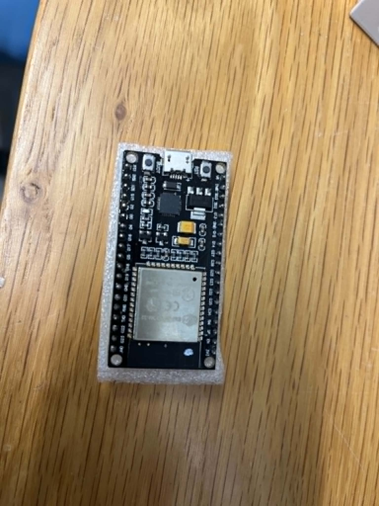
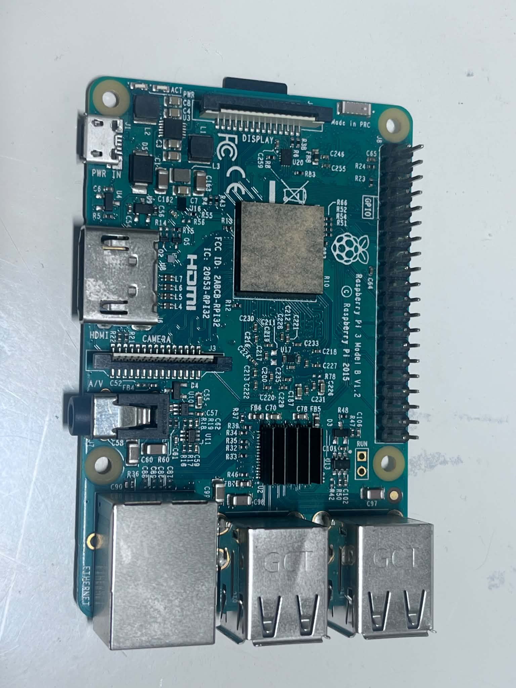
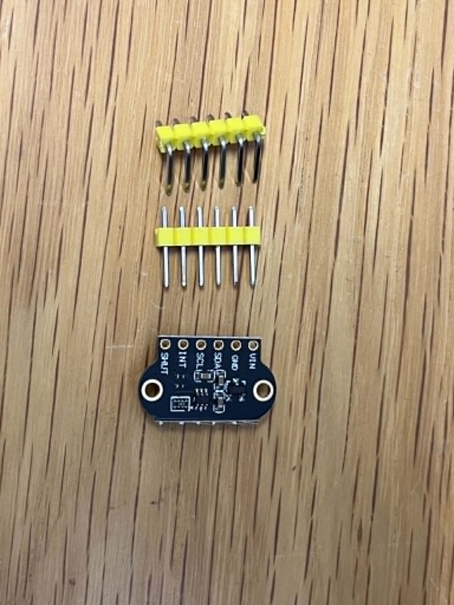
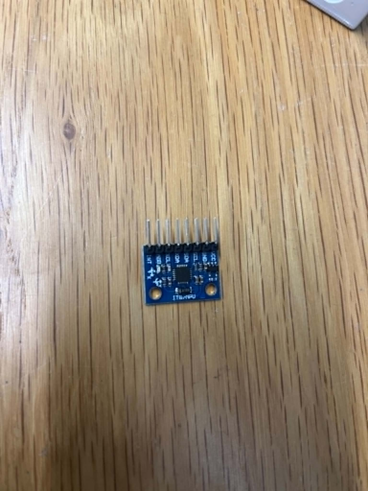
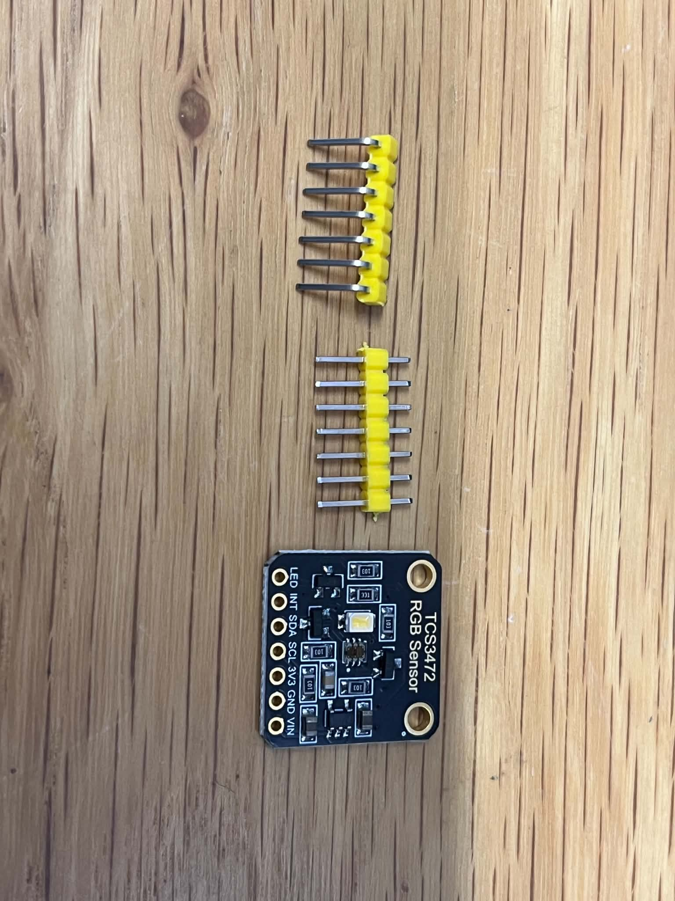
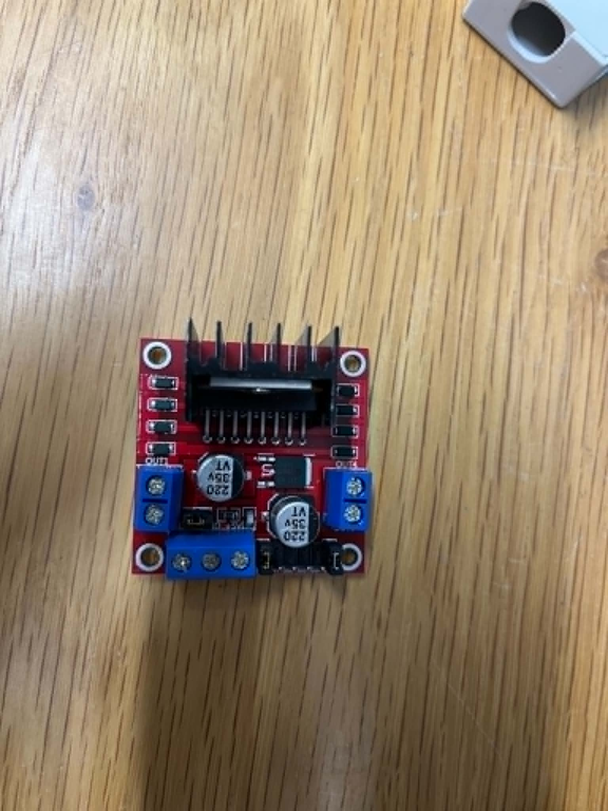
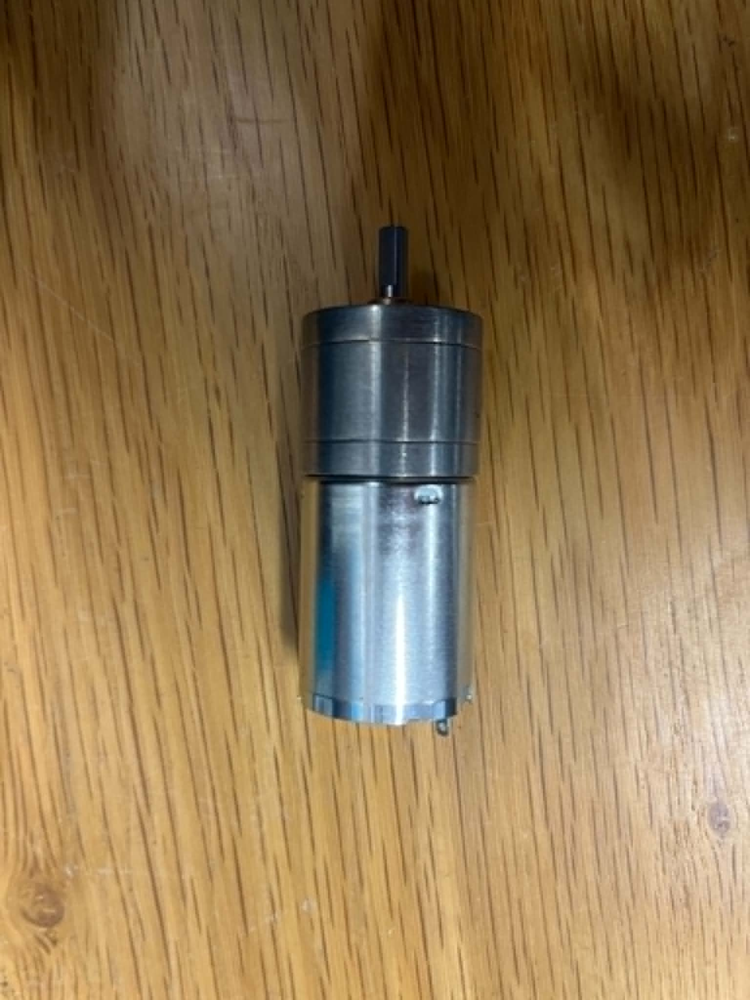
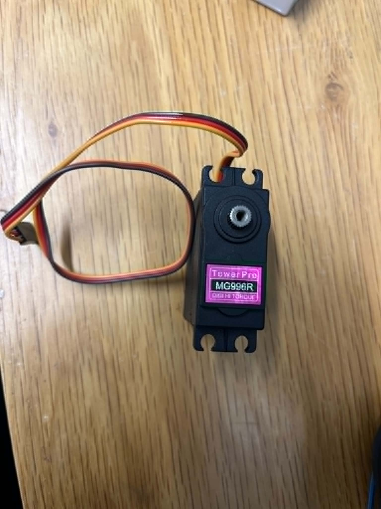
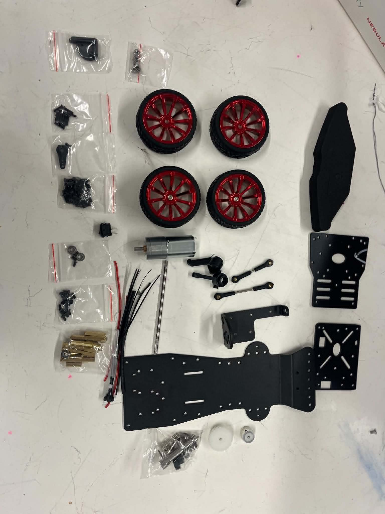

# Hardware

## Overview

The robot was designed using commercially available components that provide a balance between performance, reliability, and future expandability.

During the hardware selection process, each component was evaluated according to the project requirements rather than popularity alone. The selected hardware provides sufficient processing power, accurate sensing, reliable steering, and the flexibility required for future improvements.

The following sections describe the main hardware components used in the robot and the purpose of each one.

## Hardware Summary

| Component        | Model                  | Purpose                                           |
| ---------------- | ---------------------- | ------------------------------------------------- |
| Main Controller  | ESP32                  | Real-time control of sensors, motor, and steering |
| Vision Computer  | Raspberry Pi 3 Model B | Future computer vision processing                 |
| Distance Sensors | 2 × VL53L1X            | Wall detection and distance measurement           |
| IMU              | MPU6050                | Robot orientation and heading                     |
| Color Sensor     | TCS34725               | Detecting floor colors                            |
| Motor Driver     | L298N                  | DC motor control                                  |
| Steering Servo   | MG996R                 | Ackermann steering                                |
| Drive Motor      | DC Gear Motor          | Vehicle propulsion                                |
| DC Converter     | Buck Converter         | Stable voltage regulation                         |
| Chassis          | RC Ackermann Chassis   | Mechanical platform                               |

## Main Controller

  

**Figure 1. ESP32 development board.**

The ESP32 is the main controller of our robot. It is responsible for reading all sensors, controlling the steering servo and drive motor, processing navigation logic, and communicating with other hardware components.

We selected the ESP32 because it provides significantly higher processing performance and memory than traditional microcontrollers while maintaining low power consumption. It also supports multiple communication interfaces, allowing us to connect several sensors simultaneously and expand the system in future development stages.

### Main Responsibilities

* Reading sensor data.
* Controlling the steering servo.
* Controlling the drive motor.
* Executing the navigation algorithm.
* Communicating with the Raspberry Pi.

## Vision Computer

  

**Figure 2. Raspberry Pi 3 Model B.**

The Raspberry Pi is dedicated to high-level processing tasks that require greater computational power than a microcontroller can provide. In our project, it is intended to perform computer vision and image processing for future obstacle detection and autonomous decision-making.

Separating high-level processing from real-time control allows the ESP32 to focus on navigation while the Raspberry Pi handles computationally intensive tasks.

## Distance Sensors

  

**Figure 3. VL53L1X Time-of-Flight distance sensor.**

Two VL53L1X Time-of-Flight (ToF) sensors are used to measure the distance between the robot and the walls. Their high accuracy and fast response allow the robot to navigate reliably while maintaining a safe distance from obstacles.

We selected these sensors after comparing them with ultrasonic sensors. Their higher accuracy and measurement stability made them more suitable for reliable wall following.

## Inertial Measurement Unit (IMU)

  

**Figure 4. MPU6050 IMU sensor.**

The MPU6050 combines a 3-axis accelerometer and a 3-axis gyroscope. It is used to estimate the robot's orientation and heading while driving.

The sensor helps improve turning accuracy and allows the robot to maintain a more stable trajectory during autonomous navigation.

## Color Sensor

  

**Figure 5. TCS34725 color sensor.**

The TCS34725 is used to detect floor colors during the competition. The sensor measures the intensity of red, green, blue, and clear light, allowing the robot to distinguish between different colored markers.

Reliable color detection is essential for making correct navigation decisions during the challenge.

## Motor Driver

  

**Figure 6. L298N motor driver.**

The L298N motor driver controls the DC drive motor by regulating its direction and speed according to commands received from the ESP32.

Using a dedicated motor driver isolates the controller from the motor's power requirements and enables stable motor operation.

## Drive System

  

**Figure 7. DC gear motor.**

The DC gear motor provides the driving force required to move the robot. It is controlled by the L298N motor driver, allowing the ESP32 to regulate both speed and direction during autonomous navigation.

---

## Steering System

  

**Figure 8. MG996R steering servo.**

The MG996R servo controls the Ackermann steering mechanism by adjusting the steering angle according to the navigation algorithm. Accurate steering is essential for smooth turns and stable wall following.

---

## Mechanical Platform

  

**Figure 9. Main mechanical components before assembly.**

The robot is built on a commercially available Ackermann steering chassis., providing realistic vehicle steering similar to a real car. This configuration offers smoother turning behavior and matches the requirements of the WRO Future Engineers competition.

The chassis was selected because it provides a stable mechanical platform while allowing easy maintenance and future modifications during the development process.

## Current Hardware Status

At the current stage of the project, all major hardware components have been selected and assembled except for the final battery solution, which is still under evaluation.

The battery will be selected after completing the power consumption analysis to ensure stable operation of the Raspberry Pi, ESP32, sensors, and actuators under full system load.
