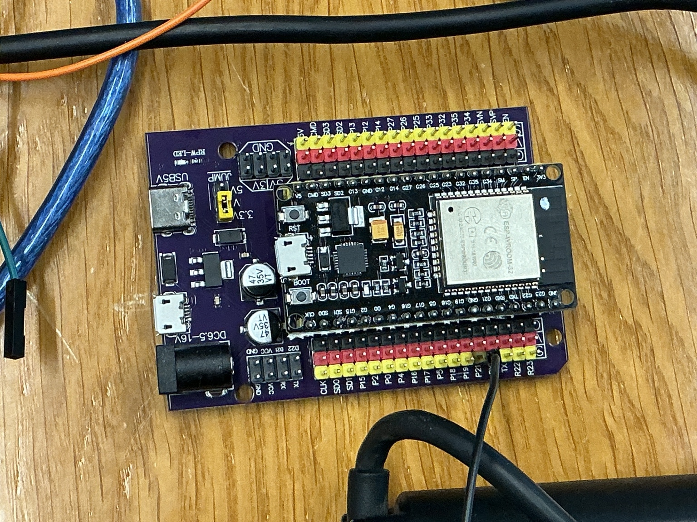
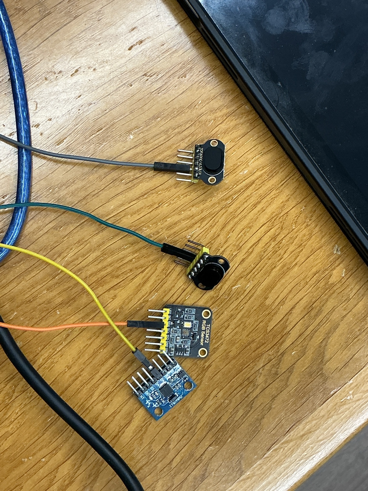

# Engineering Journal

## Project Timeline

This journal documents the engineering development of our WRO Future Engineers 2026 robot from the initial research stage to the final autonomous vehicle.

Instead of documenting only the final robot, this journal records the complete engineering process, including research, design decisions, hardware assembly, software development, testing, failures, improvements, and validation.

---

# Phase 1 — Research & Planning

**Period:** March 2026 – April 2026

## Objective

Before purchasing any hardware, our objective was to understand the competition requirements and design an autonomous robot that would be reliable, modular, and continuously improvable throughout the season.

## Research Questions

| Engineering Question | Why was it important? | Final Decision |
|----------------------|-----------------------|----------------|
| Which controller should control the robot? | Real-time motor and sensor control is essential. | ESP32 |
| Which computing platform should process computer vision? | Camera processing requires higher computational power. | Raspberry Pi 3 Model B |
| Which distance sensor should be used? | Accurate and reliable wall detection. | VL53L1X |
| Which steering mechanism should be used? | Stable autonomous navigation. | Ackermann Steering |
| How should the robot be designed? | Allow future upgrades without rebuilding the robot. | Modular architecture |

## Engineering Goals

Our project was not only about participating in the competition.

We wanted to challenge ourselves by building a complete autonomous robot from scratch and gain practical engineering experience beyond our university courses.

Throughout the project, we focused on learning new technologies, experimenting with different solutions, and continuously improving the robot after every test.

Although learning was our main motivation, we were equally determined to build the best possible robot and compete at the highest level in WRO Future Engineers.

## Engineering Design Meeting 01

  

**Figure 1.** Research and planning session before selecting the robot architecture.

During this stage, we studied the official WRO Future Engineers rules, evaluated different hardware platforms, and compared multiple technical solutions before making any purchasing decisions.

### Objective

Understand the competition requirements and evaluate possible hardware platforms before making engineering decisions.

### Outcome

- Defined the main engineering objectives.
- Identified the robot's functional requirements.
- Selected the initial system architecture for future development.

# Phase 2 — Hardware Assembly

**Period:** June 2026

## Objective

Assemble the mechanical platform and verify that all mechanical components operate correctly before integrating the electronic hardware.

---

## Gearbox Inspection

Before assembling the chassis, we opened the gearbox to inspect the internal gear arrangement and verify that all moving parts were correctly installed.

  

**Figure 2.** Internal gearbox inspection before assembly.

During this inspection, we also started analyzing the drivetrain mechanically. The gearbox was opened to understand the internal gear arrangement and prepare for calculating the gear ratio, output torque, and expected wheel speed.

These calculations are important because they help us estimate whether the motor can provide enough torque to move the robot reliably while maintaining an appropriate speed for autonomous navigation.

---

## Mechanical Assembly

The chassis was assembled by installing the gearbox, steering mechanism, suspension components, wheels, and structural parts according to the manufacturer's instructions. During the assembly process, we ensured that all moving parts operated smoothly and that the steering mechanism was correctly aligned.

  
  

**Figure 3.** Chassis assembly process and completed mechanical platform.

---

## Mechanical Verification

After completing the chassis assembly, we verified the robot dimensions and measured its weight before starting the electronics integration.

| Width Measurement | Weight Measurement |
|:-----------------:|:------------------:|
|  |  |

**Figure 4.** Initial mechanical verification.

## Phase Summary

The mechanical platform was successfully assembled and verified before integrating the electronic components. At this stage, the robot structure was ready for the next phase, which focused on installing the controllers, sensors, and electrical connections.

# Phase 3 — Electronics Integration

**Period:** June 2026

## Raspberry Pi Evaluation

Before integrating the electronic system, we evaluated the Raspberry Pi 3 Model B as a possible computing platform for future computer vision tasks.

The operating system was installed on a microSD card and the board was powered for the first time. During the initial evaluation, the first Raspberry Pi board showed unstable behavior, which prevented reliable operation. After investigating the issue, the board was replaced and testing continued using another Raspberry Pi 3 Model B.

This experience highlighted the importance of validating hardware before integrating it into the robot and helped us avoid future debugging problems.

## ESP32 Platform Preparation

After evaluating the Raspberry Pi, we prepared the ESP32 development board for sensor integration. An expansion board was used to simplify wiring and improve access to power and communication pins during development.

  

**Figure 7.** Initial ESP32 setup for electronics development.

## Initial Sensor Testing

The development process continued by testing each sensor individually before integrating the complete electronic system.

The MPU6050 IMU and the TCS34725 color sensor were successfully detected and communicated correctly with the ESP32.

The VL53L1X distance sensor was then tested. During this stage, communication issues were encountered while configuring multiple sensors on the same I²C bus. Several software modifications and hardware checks were performed in an attempt to resolve the problem before continuing the integration process.

  

**Figure 8.** Initial individual sensor testing using the ESP32.

## Engineering Notes

At the end of this development session, the ESP32 platform had been successfully prepared, the MPU6050 and TCS34725 sensors had been validated, and troubleshooting of the VL53L1X communication issue was still in progress.

Further electronics integration will continue after resolving the I²C communication between the distance sensors.

# Phase 4 — System Integration

**Period:** July 2026

## Objective

Integrate all mechanical, electronic, and software components into a single autonomous robotic platform while ensuring that every subsystem operates reliably under real testing conditions.

Unlike the previous development phases, this stage focused on making every component communicate correctly while maintaining stable performance during continuous operation.

---

## Mechanical and Electronic Integration

After validating the individual hardware components, all electronics were installed inside the robot chassis.

Special attention was given to component placement, cable routing, and power distribution. The objective was not only to make the robot functional, but also to simplify future maintenance and reduce the possibility of loose connections during testing.

The ESP32, Raspberry Pi, motor driver, steering servo, sensors, and voltage regulator were installed while maintaining easy access for troubleshooting and future modifications.

  

**Figure 9.** Final wiring and electronics integration.

---

## Power Distribution Verification

Before powering the complete robot, every electrical connection was inspected.

Voltage measurements were performed to verify that each subsystem received the correct supply voltage and that all grounds were properly connected.

Only after confirming the electrical integrity of the system was the robot powered as a complete platform.

This verification reduced the risk of hardware damage during the first full-system startup.

---

## Initial Full-System Validation

The robot was powered with every subsystem connected simultaneously for the first time.

Instead of immediately testing autonomous navigation, every subsystem was verified independently while installed on the completed robot.

The following components were successfully validated:

- ESP32 controller
- Raspberry Pi
- Steering servo
- Drive motor
- MPU6050 IMU
- VL53L1X distance sensors
- TCS34725 color sensor
- Serial communication between controllers

Successful validation confirmed that hardware integration had been completed correctly and that software development could continue safely.

---

## Integration Challenges

Although each component worked correctly when tested individually, integrating them into one complete system introduced additional challenges.

Several debugging sessions were required to verify communication between sensors, ensure stable power delivery, and confirm that multiple subsystems could operate simultaneously without interfering with each other.

These tests demonstrated the importance of validating both individual modules and the complete integrated system.

---

## Phase Summary

At the end of this phase, the robot had evolved from a collection of independent components into a fully integrated robotic platform ready for autonomous software development and field testing.

# Phase 5 — Software Development

**Period:** July 2026

## Objective

Develop reliable and modular software capable of controlling the autonomous robot while allowing continuous improvements throughout the development process.

Rather than writing one large program, the software was divided into independent modules that could be tested, debugged, and improved separately before being integrated into the final system.

---

## Modular Software Architecture

The control software was developed using a modular approach.

Each subsystem was implemented independently to simplify debugging and reduce software complexity.

The first completed software modules included:

- Motor control
- Steering control
- IMU communication
- Distance measurement
- Color detection
- Serial communication between the ESP32 and Raspberry Pi

Testing each module individually allowed problems to be isolated more easily before integrating the complete navigation system.

---

## Sensor Validation

Before implementing autonomous navigation, every sensor was evaluated independently.

Sensor readings were continuously monitored to verify communication stability and measurement consistency.

Special attention was given to the VL53L1X distance sensors and the TCS34725 color sensor, since reliable sensor data is essential for autonomous navigation.

Any unexpected readings were investigated before continuing with software integration.

---

## Color Sensor Calibration

The TCS34725 color sensor required multiple calibration sessions before it could reliably distinguish between the competition markers.

Different lighting conditions produced noticeable changes in the measured RGB values.

To improve reliability, repeated experiments were performed by presenting orange and blue markers to the sensor while observing the measured values through the serial monitor.

Based on these observations, the software thresholds were adjusted several times until the detection became more consistent.

Color calibration remains an ongoing process as additional testing is performed under different environmental conditions.

---

## Autonomous Navigation Development

After validating the individual software modules, work began on autonomous navigation.

Initially, the robot was programmed to perform basic movements such as driving forward, steering accurately, and responding to sensor measurements.

Gradually, additional navigation logic was introduced, allowing the robot to combine information from multiple sensors while making autonomous driving decisions.

The navigation algorithm continued to evolve after every testing session.

---

## Continuous Software Refinement

Software development did not end after the first successful autonomous run.

Instead, every practice session generated new observations that resulted in additional improvements.

Whenever unexpected robot behavior was observed, the software was analyzed and only one parameter was modified before repeating the same experiment.

This systematic approach made it possible to evaluate the effect of each modification independently while avoiding unnecessary changes to already validated modules.

---

## Phase Summary

By the end of this phase, the robot was capable of autonomous operation using integrated sensor data, while its software architecture remained modular, organized, and ready for continuous optimization during field testing.

# Phase 6 — Robot Testing

**Period:** July 2026 – Present

## Objective

Evaluate the robot under realistic competition conditions and continuously improve its mechanical design, electronics, and software through systematic testing and iterative engineering.

Unlike previous phases, the primary objective was no longer to build new features, but to improve the robot's reliability, repeatability, and overall autonomous performance.

---

## Progressive Testing Strategy

Testing followed a structured workflow rather than evaluating the complete robot immediately.

Every new feature was first tested independently before being combined with the rest of the navigation system.

This incremental approach made debugging significantly easier because unexpected behavior could be traced back to a specific subsystem instead of the entire robot.

---

## Bench Testing

Before testing the robot on the practice field, every software modification was verified on the workbench.

Individual components such as the steering servo, drive motor, IMU, distance sensors, and color sensor were tested independently to confirm that they behaved as expected.

Bench testing allowed software problems to be identified quickly before introducing additional variables such as vehicle motion and environmental conditions.

---

## Practice Field Testing

After individual verification, the robot was tested on a practice field designed to simulate the official WRO Future Engineers challenge.

Instead of focusing only on completing the course, every testing session was treated as an engineering experiment.

During each run, observations were recorded regarding the robot's movement, turning behavior, wall-following performance, and overall consistency.

These observations guided the next software modifications.

---

## Color Detection Calibration

Reliable color detection required considerably more testing than initially expected.

The TCS34725 sensor was evaluated under different lighting conditions while repeatedly observing the measured RGB values through the serial monitor.

Orange and blue markers were presented to the sensor multiple times to verify that they were consistently detected before integrating the detection algorithm into the navigation software.

Whenever inconsistent detections were observed, the software thresholds were adjusted and the experiment was repeated.

This iterative calibration process significantly improved the reliability of color recognition.

---

## Turn Timing Evaluation

Determining the correct moment to initiate each turn was another important part of the testing process.

Different turning strategies were evaluated by observing when the robot started steering after detecting a marker.

Small software adjustments were introduced between runs until the turning position became more consistent and repeatable.

Rather than relying on a single successful attempt, every modification was evaluated across multiple consecutive laps.

---

## Wall Following Optimization

Maintaining a stable distance from the wall required continuous refinement.

Although the robot was capable of detecting the wall, achieving smooth and consistent wall following proved to be more challenging.

Several software parameters influencing steering behavior were gradually adjusted after every testing session.

The robot's trajectory was carefully observed before deciding whether a modification represented a genuine improvement.

---

## Long-Term Stability Testing

Some behaviors only became visible after the robot had been operating for several laps.

For example, the robot occasionally completed the first lap successfully but gradually drifted closer to the wall during later laps.

Instead of immediately introducing major software changes, every possible cause was investigated individually.

Possible factors included steering calibration, sensor measurements, navigation parameters, and accumulated heading error.

This systematic investigation helped eliminate unnecessary modifications while improving the robot's long-term stability.

---

## Incremental Software Refinement

Software improvements were introduced gradually throughout development.

After every testing session, only one software parameter was modified before repeating the same experiment.

This approach allowed the effect of every modification to be evaluated independently while avoiding unexpected interactions between multiple simultaneous changes.

As a result, the navigation software became progressively more reliable after each development cycle.

---

## Performance Evaluation

Each testing session was evaluated using multiple engineering criteria instead of simply checking whether the robot completed the course.

The following characteristics were continuously monitored:

- Color detection reliability
- Wall-following consistency
- Steering stability
- Turning accuracy
- Number of successfully completed laps
- Overall repeatability
- Robot behavior after extended operation

Monitoring these characteristics provided objective feedback for future improvements.

---

## Engineering Workflow

Every engineering improvement followed the same structured methodology:

1. Observe the robot's behavior.
2. Identify the possible cause of the problem.
3. Modify one parameter only.
4. Repeat the experiment.
5. Compare the new results with previous observations.
6. Keep the modification only if measurable improvement was achieved.

Following this workflow prevented unnecessary software changes and ensured that every engineering decision was supported by practical testing.

---

## Continuous Improvements

Development is still ongoing.

Every practice session continues to generate new observations that lead to further software tuning, sensor calibration, and mechanical refinements.

The primary objective is no longer adding new features, but improving consistency, repeatability, and overall competition reliability.

---

## Phase Summary

Robot testing transformed the project from a functional autonomous vehicle into a continuously improving engineering platform.

Rather than searching for immediate solutions, repeated observation, experimentation, and evidence-based improvements became the foundation of the entire development process.

# Phase 7 — Design Iterations

**Period:** Throughout the Development Process

## Objective

Improve the robot continuously by analyzing test results and refining both the hardware and software instead of treating the first design as the final solution.

Every engineering modification was introduced only after practical testing demonstrated that an improvement was necessary.

---

## Sensor Position Optimization

The placement of several sensors changed multiple times throughout development.

Although the sensors operated correctly, small changes in their mounting position significantly affected measurement quality, field of view, and overall navigation performance.

Several mounting configurations were evaluated before selecting the final positions that provided the most stable and repeatable measurements.

---

## Mechanical Improvements

The mechanical structure also evolved during development.

Component placement was adjusted to improve weight distribution, simplify maintenance, and reduce unnecessary movement inside the chassis.

Several 3D printed mounts were redesigned after practical testing to improve stability and simplify installation.

Cable routing was also improved to reduce clutter and make future maintenance easier.

---

## Software Evolution

The navigation software changed continuously throughout the project.

Instead of rewriting the complete program after every experiment, individual modules were refined independently.

Wall-following algorithms, color detection thresholds, steering behavior, and navigation parameters were gradually improved after every testing session.

This modular development strategy reduced debugging time while allowing previously validated software components to remain unchanged.

---

## Continuous Design Improvements

Every testing session produced new engineering observations.

Rather than considering unexpected behavior as a failure, each observation became an opportunity to improve the robot.

Small engineering refinements accumulated throughout the season, resulting in a robot that became progressively more reliable, stable, and predictable.

---

## Phase Summary

The robot's final design was not created in a single step.

Instead, it was the result of continuous engineering iterations driven by testing, observation, analysis, and evidence-based improvements.

# Phase 8 — Engineering Challenges

## Objective

Identify technical challenges encountered during development and describe the engineering process used to overcome them.

Rather than avoiding problems, each challenge became an opportunity to better understand the robot and improve its overall performance.

---

## Challenge 1 — I²C Communication

One of the earliest technical challenges involved establishing reliable communication with multiple VL53L1X distance sensors on the same I²C bus.

Several software configurations and hardware adjustments were evaluated before achieving stable initialization and communication.

This experience reinforced the importance of validating every subsystem independently before integrating the complete robot.

---

## Challenge 2 — Color Detection Reliability

Reliable color detection proved to be more complex than initially expected.

Lighting conditions affected the measured RGB values, making fixed threshold values insufficient during early testing.

Repeated calibration sessions were performed while observing live sensor readings, allowing the detection algorithm to be refined gradually until more consistent performance was achieved.

---

## Challenge 3 — Navigation Consistency

Although the robot could complete individual laps successfully, maintaining consistent behavior over repeated laps required considerably more development.

Small deviations gradually accumulated during extended operation, occasionally causing the robot to approach the wall more closely than intended.

Instead of introducing large software changes, every parameter was evaluated independently until repeatability improved.

---

## Challenge 4 — Software Optimization

As additional navigation features were introduced, maintaining organized and readable software became increasingly important.

The software architecture was continuously reorganized into independent modules, simplifying debugging and reducing the risk of introducing new errors while implementing additional features.

---

## Phase Summary

Each engineering challenge improved both the robot and our engineering methodology.

The experience gained while solving these problems became as valuable as the final technical solutions themselves.

# Lessons Learned

Developing an autonomous robot required much more than assembling hardware and writing software.

Throughout the project we learned to:

- Evaluate engineering trade-offs before making technical decisions.
- Design modular hardware that simplifies future upgrades.
- Validate individual components before complete system integration.
- Debug hardware and software systematically.
- Base engineering decisions on experimental observations instead of assumptions.
- Improve system reliability through continuous iteration.
- Document every stage of development for future reference.

Perhaps the most valuable lesson was understanding that successful engineering is an iterative process built on testing, observation, and continuous refinement rather than immediate perfection.

# Future Improvements

Although the robot is fully operational, development continues beyond the current competition season.

Future work may include:

- Further optimization of computer vision algorithms.
- Additional improvements to navigation consistency.
- More advanced sensor fusion techniques.
- Mechanical redesign of selected 3D printed components.
- Additional software optimization for faster decision making.
- Continued testing under different environmental conditions.
- Further refinement of autonomous driving strategies.

Continuous improvement remains one of the primary engineering principles of this project.

# Final Reflection

The development of our WRO Future Engineers robot has been a multidisciplinary engineering journey involving mechanical design, electronics, embedded programming, computer vision, testing, and autonomous navigation.

Rather than focusing only on producing a competition robot, this project challenged us to think systematically, evaluate engineering trade-offs, validate ideas experimentally, and improve our work through continuous iteration.

Every successful test, unexpected behavior, and engineering challenge contributed to a better understanding of autonomous robotic systems.

The robot presented in this repository is therefore much more than the final result—it represents months of research, experimentation, teamwork, engineering decisions, and continuous improvement.

Most importantly, this project strengthened our ability to approach complex engineering problems with patience, structured thinking, and evidence-based decision making, skills that will continue to benefit us in future engineering projects.
