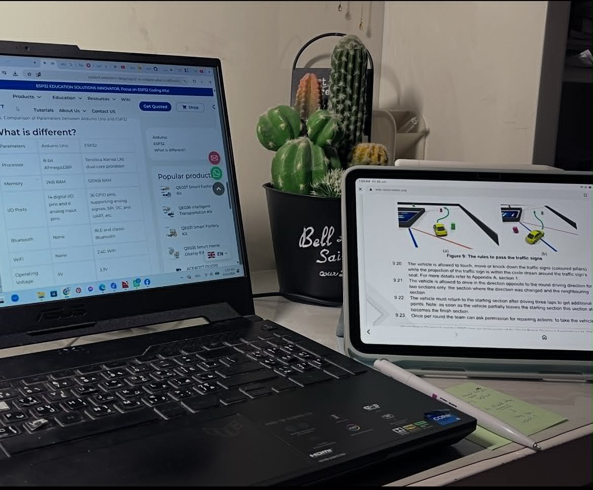
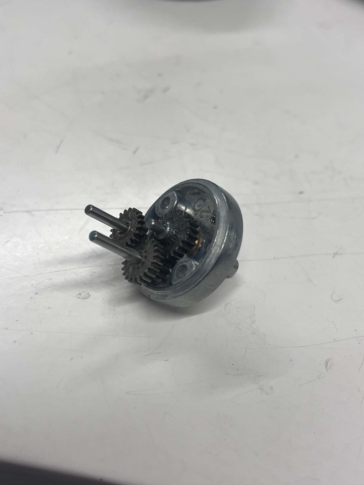
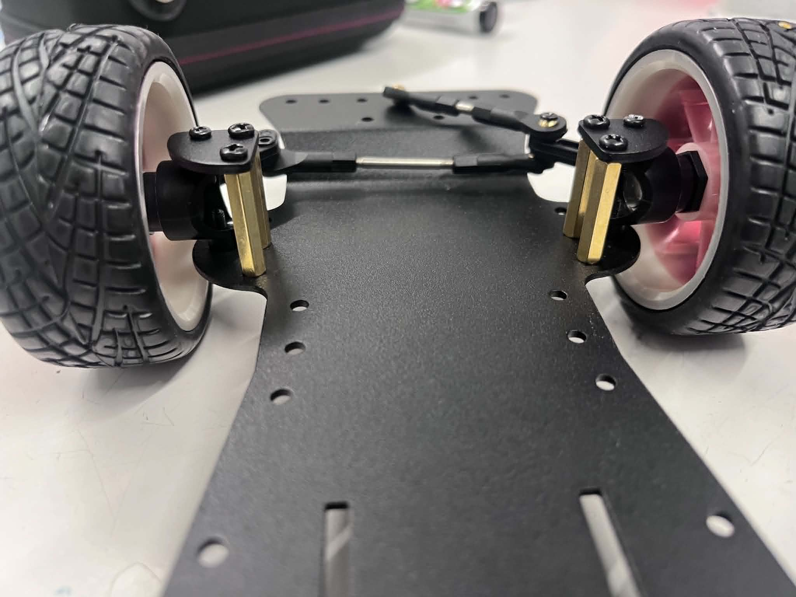
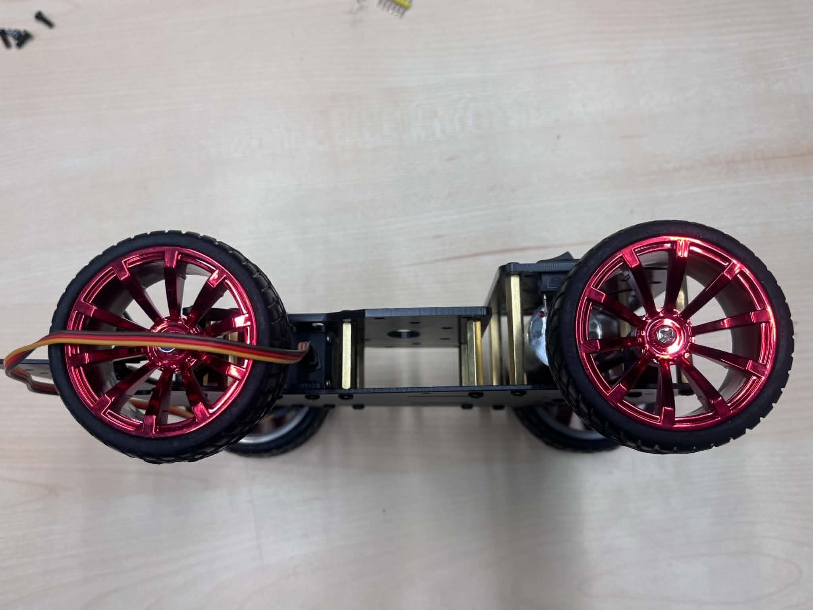
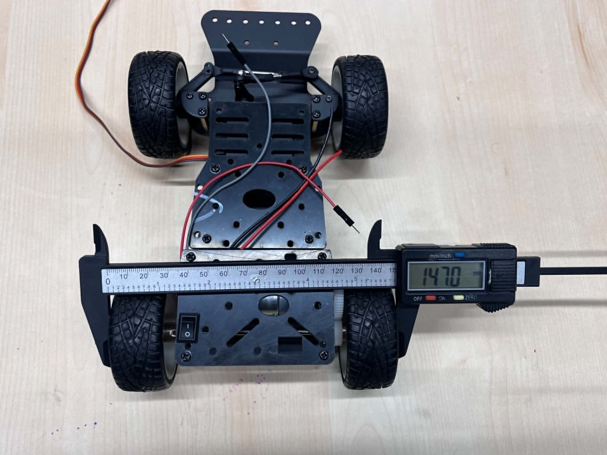
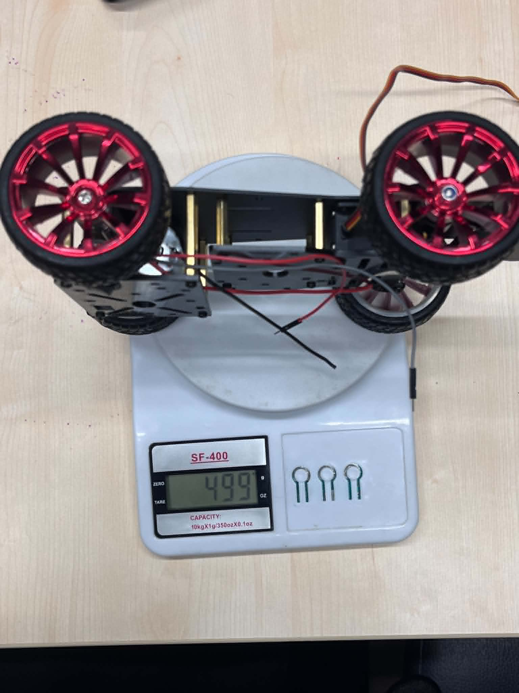

# Engineering Journal

## Project Timeline

This journal documents the engineering development of our WRO Future Engineers 2026 robot from the initial research stage to the final autonomous vehicle.

Instead of documenting only the final robot, this journal records the complete engineering process, including research, design decisions, hardware assembly, software development, testing, failures, improvements, and validation.

---

# Phase 1 — Research & Planning

**Period:** March 2026 – April 2026

## Objective

Before purchasing any hardware, our objective was to understand the competition requirements and design an autonomous robot that would be reliable, modular, and continuously improvable throughout the season.

## Research Questions

| Engineering Question | Why was it important? | Final Decision |
|----------------------|-----------------------|----------------|
| Which controller should control the robot? | Real-time motor and sensor control is essential. | ESP32 |
| Which computing platform should process computer vision? | Camera processing requires higher computational power. | Raspberry Pi 3 Model B |
| Which distance sensor should be used? | Accurate and reliable wall detection. | VL53L1X |
| Which steering mechanism should be used? | Stable autonomous navigation. | Ackermann Steering |
| How should the robot be designed? | Allow future upgrades without rebuilding the robot. | Modular architecture |

## Engineering Goals

Our project was not only about participating in the competition.

We wanted to challenge ourselves by building a complete autonomous robot from scratch and gain practical engineering experience beyond our university courses.

Throughout the project, we focused on learning new technologies, experimenting with different solutions, and continuously improving the robot after every test.

Although learning was our main motivation, we were equally determined to build the best possible robot and compete at the highest level in WRO Future Engineers.

## Engineering Design Meeting 01

  

**Figure 1.** Research and planning session before selecting the robot architecture.

During this stage, we studied the official WRO Future Engineers rules, evaluated different hardware platforms, and compared multiple technical solutions before making any purchasing decisions.

### Objective

Understand the competition requirements and evaluate possible hardware platforms before making engineering decisions.

### Outcome

- Defined the main engineering objectives.
- Identified the robot's functional requirements.
- Selected the initial system architecture for future development.

# Phase 2 — Hardware Assembly

**Period:** June 2026

## Objective

Assemble the mechanical platform and verify that all mechanical components operate correctly before integrating the electronic hardware.

---

## Gearbox Inspection

Before assembling the chassis, we opened the gearbox to inspect the internal gear arrangement and verify that all moving parts were correctly installed.

  

**Figure 2.** Internal gearbox inspection before assembly.

---

## Mechanical Assembly

The chassis was assembled by installing the gearbox, steering mechanism, suspension components, wheels, and structural parts according to the manufacturer's instructions. During the assembly process, we ensured that all moving parts operated smoothly and that the steering mechanism was correctly aligned.

  
  

**Figure 3.** Chassis assembly process and completed mechanical platform.

---

## Mechanical Verification

After completing the chassis assembly, we verified the robot dimensions and measured its weight before starting the electronics integration.

| Width Measurement | Weight Measurement |
|:-----------------:|:------------------:|
|  |  |

**Figure 4.** Initial mechanical verification.

## Phase Summary

The mechanical platform was successfully assembled and verified before integrating the electronic components. At this stage, the robot structure was ready for the next phase, which focused on installing the controllers, sensors, and electrical connections.

# Phase 3 — Electronics Integration

**Period:** June 2026

## Raspberry Pi Evaluation

Before integrating the electronic system, we evaluated the Raspberry Pi 3 Model B as a possible computing platform for future computer vision tasks.

The operating system was installed on a microSD card and the board was powered for the first time. During the initial evaluation, the first Raspberry Pi board showed unstable behavior, which prevented reliable operation. After investigating the issue, the board was replaced and testing continued using another Raspberry Pi 3 Model B.

This experience highlighted the importance of validating hardware before integrating it into the robot and helped us avoid future debugging problems.

## ESP32 Platform Preparation

After evaluating the Raspberry Pi, we prepared the ESP32 development board for sensor integration. An expansion board was used to simplify wiring and improve access to power and communication pins during development.

  

**Figure 7.** Initial ESP32 setup for electronics development.

## Initial Sensor Testing

The development process continued by testing each sensor individually before integrating the complete electronic system.

The MPU6050 IMU and the TCS34725 color sensor were successfully detected and communicated correctly with the ESP32.

The VL53L1X distance sensor was then tested. During this stage, communication issues were encountered while configuring multiple sensors on the same I²C bus. Several software modifications and hardware checks were performed in an attempt to resolve the problem before continuing the integration process.

  

**Figure 8.** Initial individual sensor testing using the ESP32.

## Engineering Notes

At the end of this development session, the ESP32 platform had been successfully prepared, the MPU6050 and TCS34725 sensors had been validated, and troubleshooting of the VL53L1X communication issue was still in progress.

Further electronics integration will continue after resolving the I²C communication between the distance sensors.

