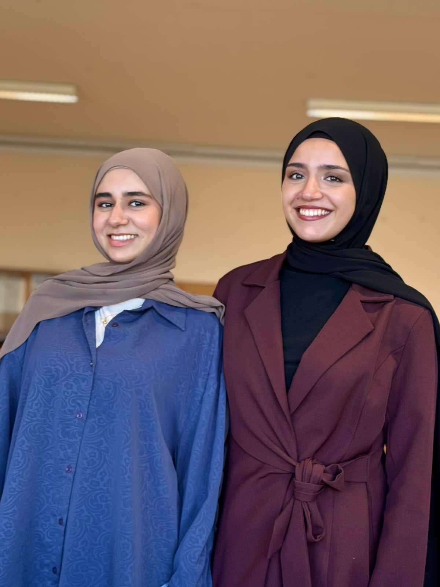
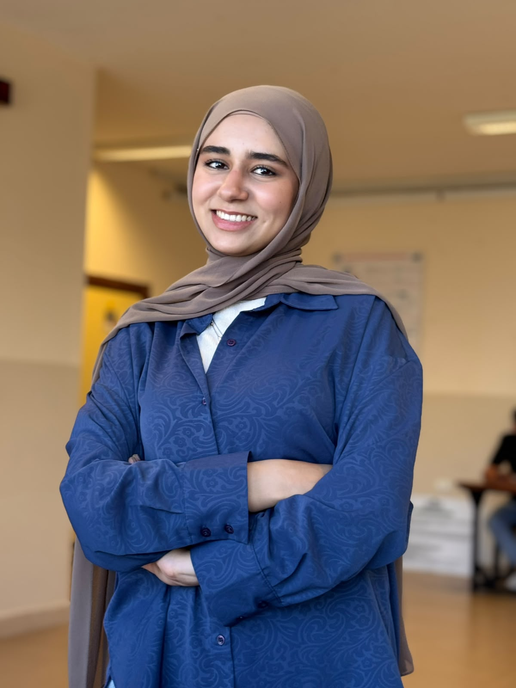
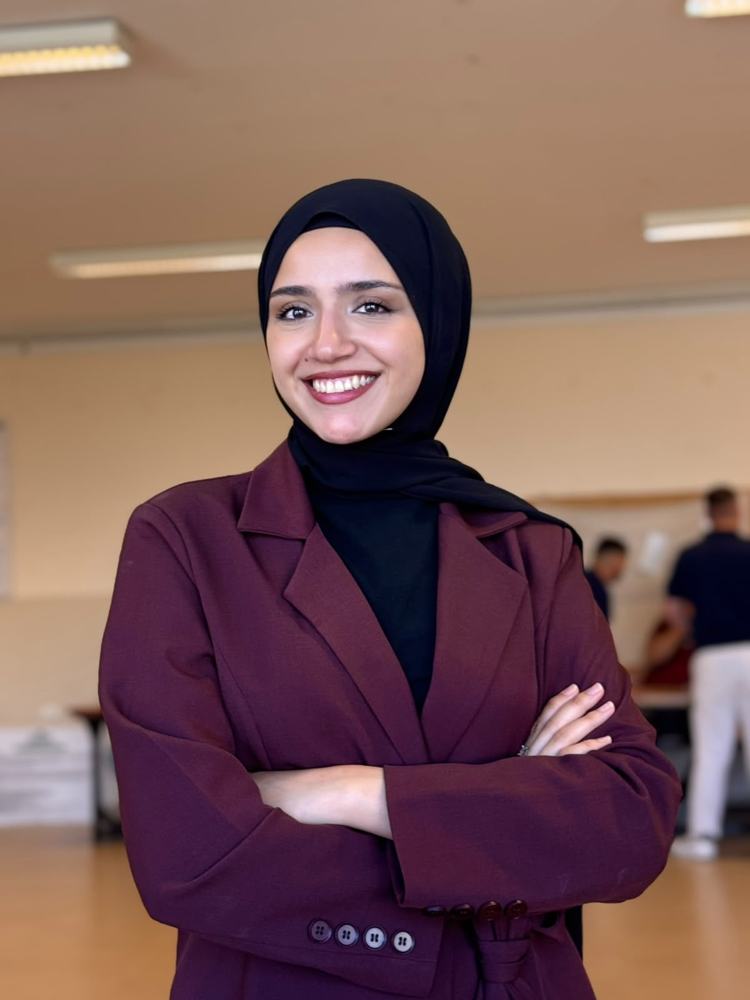

# Team

---

# NextGen Minds

We are **NextGen Minds**, a team of second-year Computer Engineering students from Birzeit University representing Palestine in the World Robot Olympiad (WRO) Future Engineers 2026.

Our team combines embedded systems, computer vision, and software engineering to design and build an autonomous Ackermann steering vehicle capable of completing the WRO challenges.

---

# Team Members

| Batool Ghanem | Sara Abuarra |
|:-------------:|:------------:|
|  |  |
| **Computer Vision** Raspberry Pi Software Documentation | **Embedded Systems** ESP32 Firmware Electronics Integration |

---

# Coach

**Osid Ali**

---

# Institution

Birzeit University

---

# Country

Palestine 🇵🇸
